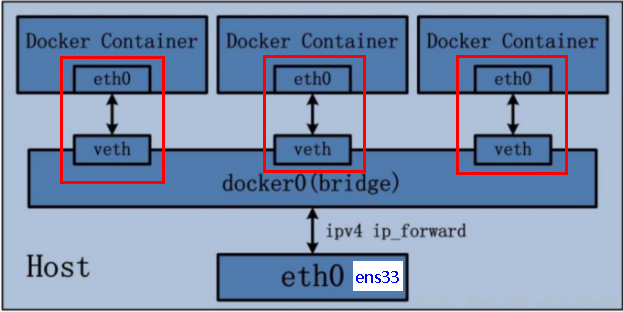
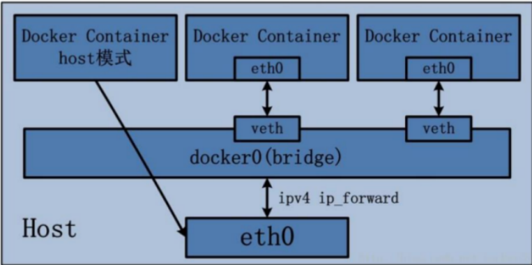
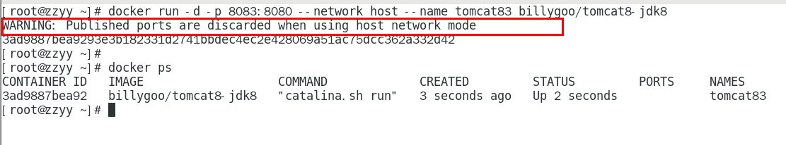
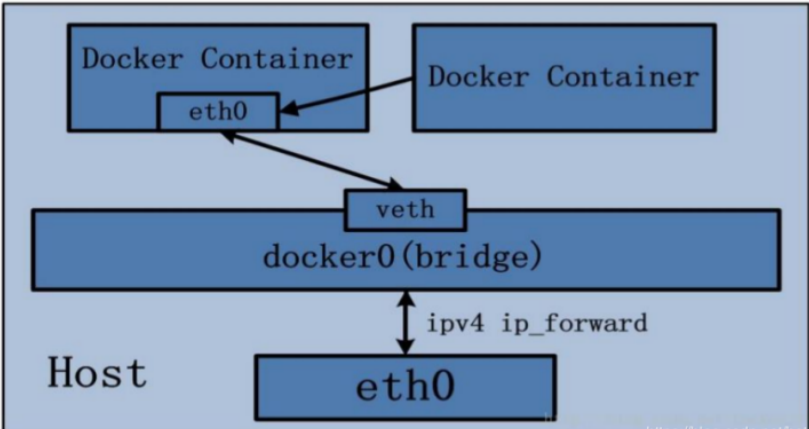

### Docker网络介绍：

宿主机默认网卡信息：

ens33：本机网卡

lo：本机回环网卡

virbr0：CentOS安装时如果选择的有相关虚拟化服务，就会多一个以网桥连接的私网地址的`virbr0`网卡，作用是为连接虚拟网卡提供NAT访问外网的功能。如果要移除该服务，可以使用 `yum remove libvirt-libs.x86_64`

启动docker容器后，会产生docker0的虚拟网桥网卡。

作用：

- 容器间的互联和通信以及端口映射
- 容器IP变动时候可以通过服务名直接网络通信而不受到影响

### docker网络相关命令：

```shell
# 查看docker网络模式
docker network ls

# 查看网络元数据
docker network inspect [网络名称]

# 添加网络
docker network create [网络名称]

# 删除网络
docker network rm [网络名称]

# 删除所有无效网络
docker network prune
```

### docker常见网络模式

|   网络模式    |                    简介                    |               使用方式               |
| :-------: | :--------------------------------------: | :------------------------------: |
|  bridge   | 为每一个容器分配、设置IP等，并将容器连接到一个`docker0`虚拟网桥，默认为该模式 |        `--network bridge`        |
|   host    |   容器将不会虚拟出自己的网卡、配置自己的IP等，而是使用宿主机的IP和端口   |         `--network host`         |
|   none    | 容器有独立的 Network namespace，但并没有对齐进行任何网络设置，如分配 `veth pari` 和 网桥连接、IP等 |         `--network none`         |
| container | 新创建的容器不会创建自己的网卡和配置自己的IP，而是和一个指定的容器共享IP、端口范围等 | `--network container:NAME或者容器ID` |

容器内默认网络IP生成规则：docker容器内部的ip是有可能会发生改变的。

### bridge模式：

Docker 服务默认会创建一个 docker0 网桥（其上有一个 docker0 内部接口），该桥接网络的名称为docker0，它在内核层连通了其他的物理或虚拟网卡，这就将所有容器和本地主机都放到同一个物理网络。Docker 默认指定了 docker0 接口 的 IP 地址和子网掩码，让主机和容器之间可以通过网桥相互通信。

```shell
# 查看 bridge 网络的详细信息，并通过 grep 获取名称项
docker network inspect bridge | grep name
```

1. Docker使用Linux桥接，在宿主机虚拟一个Docker容器网桥(docker0)，Docker启动一个容器时会根据Docker网桥的网段分配给容器一个IP地址，称为Container-IP，同时Docker网桥是每个容器的默认网关。因为在同一宿主机内的容器都接入同一个网桥，这样容器之间就能够通过容器的Container-IP直接通信。
2. docker run 的时候，没有指定network的话默认使用的网桥模式就是bridge，使用的就是docker0。在宿主机ifconfig,就可以看到docker0和自己create的network(后面讲)eth0，eth1，eth2……代表网卡一，网卡二，网卡三……，lo代表127.0.0.1，即localhost，inet addr用来表示网卡的IP地址
3. 网桥docker0创建一对对等虚拟设备接口一个叫veth，另一个叫eth0，成对匹配。
   -  整个宿主机的网桥模式都是docker0，类似一个交换机有一堆接口，每个接口叫veth，在本地主机和容器内分别创建一个虚拟接口，并让他们彼此联通（这样一对接口叫veth pair）;
   -  每个容器实例内部也有一块网卡，每个接口叫eth0；
   -  docker0上面的每个veth匹配某个容器实例内部的eth0，两两配对，一一匹配。

 通过上述，将宿主机上的所有容器都连接到这个内部网络上，两个容器在同一个网络下,会从这个网关下各自拿到分配的ip，此时两个容器的网络是互通的。

可启动容器在宿主机和容器内部使用**ip addr**来查看网卡是否一一对应匹配。


### host模式：

容器将不会获得一个独立的Network Namespace， 而是和宿主机共用一个Network Namespace。容器将不会虚拟出自己的网卡而是使用宿主机的IP和端口。


```shell
# 指定网络模式为host模式
docker run -d -p 8083:8080 --network host --name tomcat83 billygoo/tomcat8-jdk8
# 会提示下图所示的警告信息
# 原因：docker启动时指定--network=host或-net=host，如果还指定了-p映射端口，那这个时候就会有此警告，因为通过-p设置的参数将不会起到任何作用，端口号会以主机端口号为主，重复时则递增。

# 正确用法：
docker run -d --network host --name tomcat83 billygoo/tomcat8-jdk8
```


### none模式：

禁用了网络功能，在`none`模式下，并不为docker容器进行任何网络配置。进入容器内，使用 `ip addr`查看网卡信息，只能看到 `lo`（本地回环网络`127.0.0.1`网卡）。

### container模式：

新建的容器和已经存在的一个容器共享一个网络ip配置而不是和宿主机共享。新创建的容器不会创建自己的网卡，配置自己的IP，而是和一个指定的容器共享IP、端口范围等。同样，两个容器除了网络方面，其他的如文件系统、进程列表等还是隔离的。


示例：

```shell
# 创建两个容器且alpine2共享alpine1的网络信息
docker run -it--name alpine1  alpine /bin/sh
docker run -it --network container:alpine1 --name alpine2  alpine /bin/sh
# 分别进入各自容器使用ip addr查看网络信息比对是否使用同一网络
# 尝试关闭alpine1容器再次进入alpine2执行ip addr发现网络也随之消失了
```

### 自定义网络模式：

容器间的互联和通信以及端口映射，同一网桥下的容器间互联通信可通过ip通信，但通过服务名无法进行通信，自定义网络模式使得容器 IP 变动时候可以通过服务名直接网络通信而不受影响。

```shell
# 自定义网络模式
docker network create tomcat_network
```

使用默认网络模式：

```shell
docker run -d -p 8081:8080 --name tomcat81 billygoo/tomcat8-jdk8
docker run -d -p 8082:8080 --name tomcat82 billygoo/tomcat8-jdk8
# 各自进入容器内部查看IP信息，使用ping命令尝试是否可以ping通网络：可以ping通
# 尝试使用服务名ping对方网络：Name or service not known
```

使用自定义网络启动容器：

```shell
docker run -d -p 8081:8080 --network tomcat_network --name tomcat81 billygoo/tomcat8-jdk8
docker run -d -p 8082:8080 --network tomcat_network --name tomcat82 billygoo/tomcat8-jdk8
# 各自进入容器使用服务名尝试网络是否连通:ping tomcat81 ping tomcat82
# 结论：自定义网络本身就维护好了主机名和ip的对应关系（ip和域名都能通信）
```

