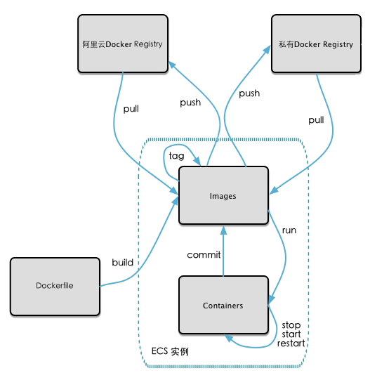
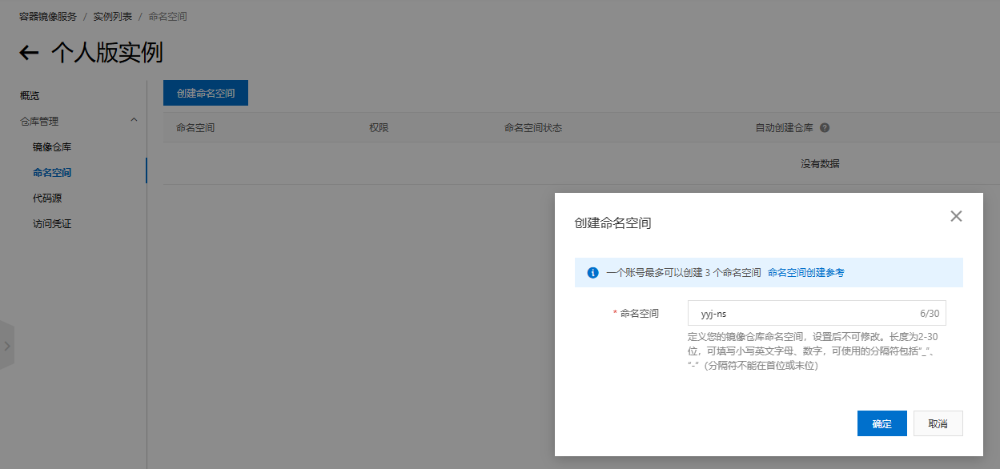
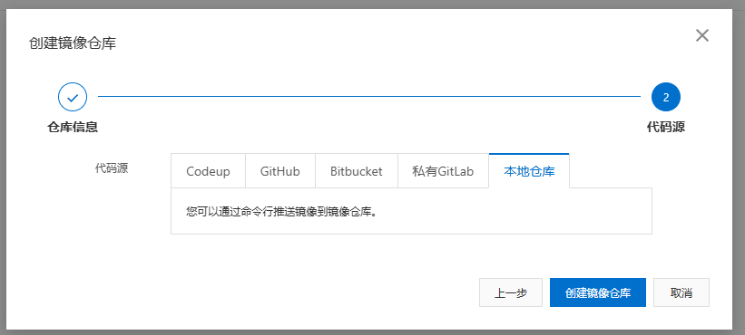

### 将本地镜像发布到阿里云仓库

本地镜像发布阿里云镜像仓库流程示意：


创建阿里云镜像仓库：

容器镜像服务-->个人实例-->命名空间-->新建命名空间-->新建仓库-->获取相关脚本;


创建镜像仓库：




官方提供的脚本操作指南：

1、登录阿里云Docker Registry

```shell
$ docker login --username=yangjiaoshou20 crpi-xgro09dauuzaxuqh.cn-hangzhou.personal.cr.aliyuncs.com
```

用于登录的用户名为阿里云账号全名，密码为开通服务时设置的密码。

您可以在访问凭证页面修改凭证密码。

2、从Registry中拉取镜像

```shell
$ docker pull crpi-xgro09dauuzaxuqh.cn-hangzhou.personal.cr.aliyuncs.com/yyj-ns/yyj-repository:[镜像版本号]
```

3、将镜像推送到Registry

```shell
$ docker login --username=yangjiaoshou20 crpi-xgro09dauuzaxuqh.cn-hangzhou.personal.cr.aliyuncs.com
$ docker tag [ImageId] crpi-xgro09dauuzaxuqh.cn-hangzhou.personal.cr.aliyuncs.com/yyj-ns/yyj-repository:[镜像版本号]
$ docker push crpi-xgro09dauuzaxuqh.cn-hangzhou.personal.cr.aliyuncs.com/yyj-ns/yyj-repository:[镜像版本号]
```

请根据实际镜像信息替换示例中的[ImageId]和[镜像版本号]参数。

4、选择合适的镜像仓库地址

从ECS推送镜像时，可以选择使用镜像仓库内网地址。推送速度将得到提升并且将不会损耗您的公网流量。

如果您使用的机器位于VPC网络，请使用 crpi-xgro09dauuzaxuqh-vpc.cn-hangzhou.personal.cr.aliyuncs.com 作为Registry的域名登录。

5、示例

使用"docker tag"命令重命名镜像，并将它通过专有网络地址推送至Registry。

```shell
$ docker images
REPOSITORY                                                         TAG                 IMAGE ID            CREATED             VIRTUAL SIZE
registry.aliyuncs.com/acs/agent                                    0.7-dfb6816         37bb9c63c8b2        7 days ago          37.89 MB
$ docker tag 37bb9c63c8b2 crpi-xgro09dauuzaxuqh-vpc.cn-hangzhou.personal.cr.aliyuncs.com/acs/agent:0.7-dfb6816
```

使用 "docker push" 命令将该镜像推送至远程。

```shell
$ docker push crpi-xgro09dauuzaxuqh-vpc.cn-hangzhou.personal.cr.aliyuncs.com/acs/agent:0.7-dfb6816
```

