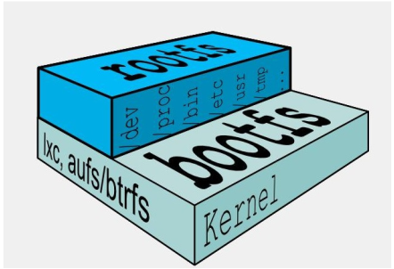
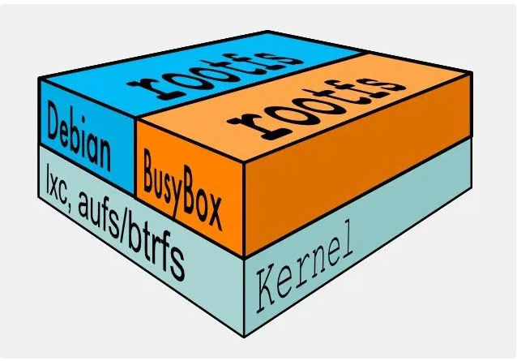
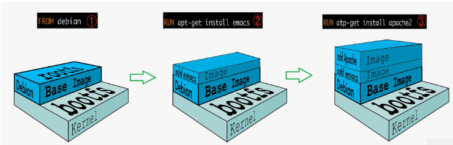
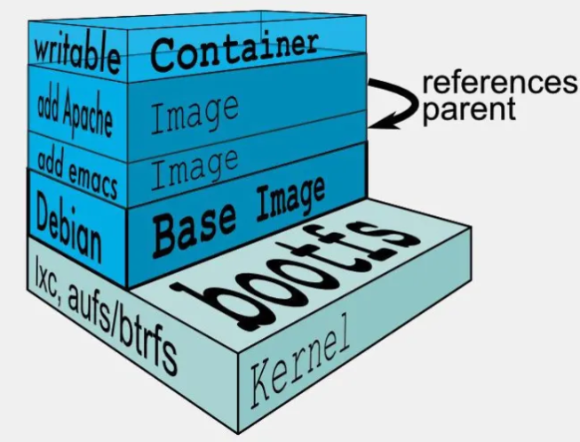

### 镜像本质

什么是镜像：
是一种轻量级、可执行的独立软件包，它包含运行某个软件所需的所有内容，我们把应用程序和配置依赖打包好形成一个可交付的运行环境(包括代码、运行时需要的库、环境变量和配置文件等)，这个打包好的运行环境就是image镜像文件。只有通过这个镜像文件才能生成Docker容器实例。

#### 镜像分层

以我们的pull为例，在下载的过程中我们可以看到docker的镜像好像是在一层一层的在下载。

### 联合文件系统

Docker 最早支持的stotage driver是 AUFS，它实际上由一层一层的文件系统组成，这种层级的文件系统叫UnionFS。

UnionFS（联合文件系统）：Union文件系统（UnionFS）是一种分层、轻量级并且高性能的文件系统，它支持对文件系统的修改作为一次提交来一层层的叠加，同时可以将不同目录挂载到同一个虚拟文件系统下(unite several directories into a single virtual filesystem)。 

Union 文件系统是 Docker 镜像的基础。镜像可以通过分层来进行继承，基于基础镜像（没有父镜像），可以制作各种具体的应用镜像。

特性：一次同时加载多个文件系统，但从外面看起来，只能看到一个文件系统，联合加载会把各层文件系统叠加起来，这样最终的文件系统会包含所有底层的文件和目录。

后来出现的docker版本中，除了AUFS，还支持OverlayFS、Btrfs、Device Mapper、VFS、ZFS等storage driver。

### docker镜像的加载原理

docker的镜像实际上由一层一层的文件系统组成，这种层级的文件系统UnionFS。

#### bootfs(boot file system)：

bootfs(boot file system)主要包含bootloader和kernel, bootloader主要是引导加载kernel, Linux刚启动时会加载bootfs文件系统，在Docker镜像的最底层是引导文件系统bootfs。这一层与我们典型的Linux/Unix系统是一样的，包含boot加载器和内核。当boot加载完成之后整个内核就都在内存中了，此时内存的使用权已由bootfs转交给内核，此时系统也会卸载bootfs。

#### rootfs (root file system) ：

在bootfs之上。包含的就是典型 Linux 系统中的 /dev, /proc, /bin, /etc 等标准目录和文件。rootfs就是各种不同的操作系统发行版，比如Ubuntu，Centos等等。 



对于一个精简的OS，rootfs可以很小，只需要包括最基本的命令、工具和程序库就可以了，因为底层直接用Host的kernel，自己只需要提供 rootfs 就行了。由此可见对于不同的linux发行版, bootfs基本是一致的, rootfs会有差别, 因此不同的发行版可以公用bootfs。

不同rootfs：


### 镜像分层

镜像分层最大的一个好处就是共享资源，方便复制迁移，就是为了复用。

比如说有多个镜像都从相同的 base 镜像构建而来，那么 Docker Host 只需在磁盘上保存一份 base 镜像；
同时内存中也只需加载一份 base 镜像，就可以为所有容器服务了。而且镜像的每一层都可以被共享。

Docker支持扩展现有镜像，创建新的镜像。新镜像是从base镜像一层一层叠加生成的。

```shell
# Version: 0.0.1
FROM debian  # 直接在debain base镜像上构建
MAINTAINER mylinux
RUN apt-get update && apt-get install -y emacs # 安装emacs
RUN apt-get install -y apache2 # 安装apache2
CMD ["/bin/bash"] # 容器启动时运行bash
```

 镜像创建过程：



### 容器层

当容器启动时，一个新的**可写层**将被加载到镜像的顶部，这一层通常被称为`容器层`，容器层之下的都叫`镜像层`。

所有对容器的改动，无论添加、删除、还是修改文件都只会发生在容器层中。

只有容器层是可写的，容器层下面的所有镜像层都是只读的。

