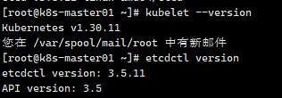
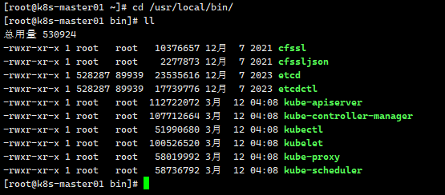
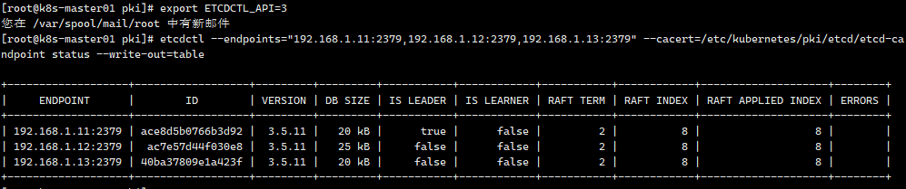

## Containerd安装

所有节点安装docker-ce-20.10：

```shell
yum install docker-ce-20.10.* docker-ce-cli-20.10.* -y
```

配置Containerd所需的模块（所有节点）：

```shell
cat <<EOF | sudo tee /etc/modules-load.d/containerd.conf
overlay
br_netfilter
EOF
```

所有节点加载模块：

```shell
modprobe -- overlay
modprobe -- br_netfilter
```

所有节点，配置Containerd所需的内核：

```shell
cat <<EOF | sudo tee /etc/sysctl.d/99-kubernetes-cri.conf
net.bridge.bridge-nf-call-iptables  = 1
net.ipv4.ip_forward                 = 1
net.bridge.bridge-nf-call-ip6tables = 1
EOF
```

所有节点加载内核：

```shell
sysctl --system
```

所有节点配置Containerd的配置文件：

```shell
mkdir -p /etc/containerd
containerd config default | tee /etc/containerd/config.toml
```

所有节点将Containerd的Cgroup改为Systemd：

```shell
vim /etc/containerd/config.toml
# 找到containerd.runtimes.runc.options，添加SystemdCgroup = true
# 所有节点将sandbox_image的Pause镜像改成符合自己版本的地址registry.cn-hangzhou.aliyuncs.com/google_containers/pause:3.6
```

所有节点启动Containerd，并配置开机自启动：

```shell
systemctl daemon-reload
systemctl enable --now containerd
```

所有节点配置crictl客户端连接的运行时位置：

```shell
cat > /etc/crictl.yaml <<EOF
runtime-endpoint: unix:///run/containerd/containerd.sock
image-endpoint: unix:///run/containerd/containerd.sock
timeout: 10
debug: false
EOF
```

## k8s组件安装

在k8s-master01上进行操作：

下载kubernetes安装包

```shell
# kubernetes官方仓库：https://github.com/kubernetes/kubernetes
# CHANGELOG找到对应版本 -- Server Binaries
wget https://dl.k8s.io/v1.30.12/kubernetes-server-linux-amd64.tar.gz
```

下载etcd安装包，在k8s的changelog中查询对应etcd版本

```shell
wget https://github.com/etcd-io/etcd/releases/download/v3.5.11/etcd-v3.5.11-linux-amd64.tar.gz
```

解压安装文件：

```shell
# 解压kubernetes安装文件
tar -xf kubernetes-server-linux-amd64.tar.gz  --strip-components=3 -C /usr/local/bin kubernetes/server/bin/kube{let,ctl,-apiserver,-controller-manager,-scheduler,-proxy}
# 命令详解：
# tar -xf：解压文件
# --strip-components=3：解压时跳过压缩包内的前 3 层目录
# -C：指定解压的目标目录（change to directory）
# kubernetes/server/bin/kube{let,ctl,-apiserver,-controller-manager,-scheduler,-proxy}:通过 通配符（Brace Expansion） 指定要解压的具体文件列表

# 解压etcd安装文件
tar -zxvf etcd-v3.5.11-linux-amd64.tar.gz --strip-components=1 -C /usr/local/bin etcd-v3.5.11-linux-amd64/etcd{,ctl}

# 解压后查看版本信息
kubelet --version
etcdctl version
```
版本信息：

解压后/usr/local/bin/对应文件为：



将组件发送到其他节点：

```shell
MasterNodes='k8s-master02 k8s-master03'
WorkNodes='k8s-node01 k8s-node02'
for NODE in $MasterNodes; do echo $NODE; scp /usr/local/bin/kube{let,ctl,-apiserver,-controller-manager,-scheduler,-proxy} $NODE:/usr/local/bin/; scp /usr/local/bin/etcd* $NODE:/usr/local/bin/; done
for NODE in $WorkNodes; do scp /usr/local/bin/kube{let,-proxy} $NODE:/usr/local/bin/ ; done
```

所有节点创建目录：

```shell
mkdir -p /opt/cni/bin
```

切换分支到指定版本分支：

```shell
cd k8s-ha-install && git checkout manual-installation-v1.30.x
```

## 证书生成

在k8s-master01上下载证书生成工具：

```shell
wget "https://pkg.cfssl.org/R1.2/cfssl_linux-amd64" -O /usr/local/bin/cfssl
wget "https://pkg.cfssl.org/R1.2/cfssljson_linux-amd64" -O /usr/local/bin/cfssljson
chmod +x /usr/local/bin/cfssl /usr/local/bin/cfssljson
```

### 制作etcd证书

所有Master节点创建etcd证书目录

```shell
mkdir -p /etc/etcd/ssl
```

所有节点创建kubernetes相关目录

```shell
mkdir -p /etc/kubernetes/pki
```

生成etcd证书

```shell
# 生成etcd的ca证书和ca-key
cd /root/k8s-ha-install/pki
cfssl gencert -initca etcd-ca-csr.json | cfssljson -bare /etc/etcd/ssl/etcd-ca
# 以上步骤生成文件：etcd-ca.csr  etcd-ca-key.pem  etcd-ca.pem

# 使用etcd的ca和ca-key签发etcd证书etcd.pem和etcd-key.pem
cfssl gencert \
   -ca=/etc/etcd/ssl/etcd-ca.pem \
   -ca-key=/etc/etcd/ssl/etcd-ca-key.pem \
   -config=ca-config.json \
   -hostname=127.0.0.1,k8s-master01,k8s-master02,k8s-master03,192.168.1.11,192.168.1.12,192.168.1.13 \
   -profile=kubernetes \
   etcd-csr.json | cfssljson -bare /etc/etcd/ssl/etcd
 # 以上步骤生成：etcd.csr  etcd-key.pem  etcd.pem
```

将生成证书发送到其他节点：

```shell
MasterNodes='k8s-master02 k8s-master03'
for NODE in $MasterNodes; do
     ssh $NODE "mkdir -p /etc/etcd/ssl"
     for FILE in etcd-ca-key.pem  etcd-ca.pem  etcd-key.pem  etcd.pem; do
       scp /etc/etcd/ssl/${FILE} $NODE:/etc/etcd/ssl/${FILE}
     done
 done
```

### 制作k8s组件证书

**生成apiserver证书：**

```shell
# 生成ca根证书
cd /root/k8s-ha-install/pki && cfssl gencert -initca ca-csr.json | cfssljson -bare /etc/kubernetes/pki/ca
# 此步骤生成：ls /etc/kubernetes/pki/
# ca.csr  ca-key.pem  ca.pem

# 使用ca签发apiserver证书
# 10.96.0.1是k8s service的网段，如果说需要更改k8s service网段，那就需要更改此网段
# 如果不是高可用集群，192.168.1.30为Master01的IP，此为虚IP地址
cfssl gencert -ca=/etc/kubernetes/pki/ca.pem -ca-key=/etc/kubernetes/pki/ca-key.pem -config=ca-config.json -hostname=10.96.0.1,192.168.1.30,127.0.0.1,kubernetes,kubernetes.default,kubernetes.default.svc,kubernetes.default.svc.cluster,kubernetes.default.svc.cluster.local,192.168.1.11,192.168.1.12,192.168.1.13 -profile=kubernetes apiserver-csr.json | cfssljson -bare /etc/kubernetes/pki/apiserver
# 此步骤生成：ls /etc/kubernetes/pki
# apiserver.csr  apiserver-key.pem  apiserver.pem
```

**生成apiserver聚合证书：**

```shell
# 生成front-proxy-ca 根证书
cd /root/k8s-ha-install/pki && cfssl gencert -initca front-proxy-ca-csr.json | cfssljson -bare /etc/kubernetes/pki/front-proxy-ca
# 生成结果：ls /etc/kubernetes/pki
# front-proxy-ca.csr  front-proxy-ca-key.pem  front-proxy-ca.pem

# 使用front-proxy-ca签发front-proxy-client证书
cfssl gencert -ca=/etc/kubernetes/pki/front-proxy-ca.pem -ca-key=/etc/kubernetes/pki/front-proxy-ca-key.pem -config=ca-config.json -profile=kubernetes front-proxy-client-csr.json | cfssljson -bare /etc/kubernetes/pki/front-proxy-client
# 生成结果：ls /etc/kubernetes/pki
# front-proxy-client.csr  front-proxy-client-key.pem  front-proxy-client.pem
```

**生成controller-manage的证书：**

```shell
# 签发controller-manage证书
cd /root/k8s-ha-install/pki && cfssl gencert -ca=/etc/kubernetes/pki/ca.pem -ca-key=/etc/kubernetes/pki/ca-key.pem -config=ca-config.json -profile=kubernetes manager-csr.json | cfssljson -bare /etc/kubernetes/pki/controller-manager
#结果：ls /etc/kubernetes/pki
# controller-manager.csr controller-manager.pem controller-manager-key.pem

# set-cluster：设置一个集群项
# 注意，如果不是高可用集群，192.168.1.30:8443改为master01的地址，8443改为apiserver的端口，默认是6443
kubectl config set-cluster kubernetes --certificate-authority=/etc/kubernetes/pki/ca.pem --embed-certs=true --server=https://192.168.1.30:8443 --kubeconfig=/etc/kubernetes/controller-manager.kubeconfig
# 结果：Cluster "kubernetes" set.

# 设置一个环境项，一个上下文
kubectl config set-context system:kube-controller-manager@kubernetes --cluster=kubernetes --user=system:kube-controller-manager --kubeconfig=/etc/kubernetes/controller-manager.kubeconfig
# 结果：Context "system:kube-controller-manager@kubernetes" created.

# set-credentials 设置一个用户项
kubectl config set-credentials system:kube-controller-manager --client-certificate=/etc/kubernetes/pki/controller-manager.pem --client-key=/etc/kubernetes/pki/controller-manager-key.pem --embed-certs=true --kubeconfig=/etc/kubernetes/controller-manager.kubeconfig
# 结果：User "system:kube-controller-manager" set.

# 使用某个环境当做默认环境
kubectl config use-context system:kube-controller-manager@kubernetes --kubeconfig=/etc/kubernetes/controller-manager.kubeconfig
结果：Switched to context "system:kube-controller-manager@kubernetes".
```

**生成scheduler证书：**

```shell
# 生成scheduler证书
cd /root/k8s-ha-install/pki && cfssl gencert -ca=/etc/kubernetes/pki/ca.pem -ca-key=/etc/kubernetes/pki/ca-key.pem -config=ca-config.json -profile=kubernetes scheduler-csr.json | cfssljson -bare /etc/kubernetes/pki/scheduler
# 结果：scheduler.csr scheduler.pem scheduler-key.pem

# set-cluster：设置一个集群项
# 注意，如果不是高可用集群，192.168.1.30:8443改为master01的地址，8443改为apiserver的端口，默认是6443
kubectl config set-cluster kubernetes --certificate-authority=/etc/kubernetes/pki/ca.pem --embed-certs=true --server=https://192.168.1.30:8443 --kubeconfig=/etc/kubernetes/scheduler.kubeconfig

# set-credentials 设置一个用户项
kubectl config set-credentials system:kube-scheduler --client-certificate=/etc/kubernetes/pki/scheduler.pem --client-key=/etc/kubernetes/pki/scheduler-key.pem --embed-certs=true --kubeconfig=/etc/kubernetes/scheduler.kubeconfig

# set-context 设置一个环境项，一个上下文
kubectl config set-context system:kube-scheduler@kubernetes --cluster=kubernetes --user=system:kube-scheduler --kubeconfig=/etc/kubernetes/scheduler.kubeconfig

# use-context 使用某个环境当做默认环境
kubectl config use-context system:kube-scheduler@kubernetes --kubeconfig=/etc/kubernetes/scheduler.kubeconfig

```

**生成kubernetes-admin证书：**

```shell
# 生成admin证书
cd /root/k8s-ha-install/pki && cfssl gencert -ca=/etc/kubernetes/pki/ca.pem -ca-key=/etc/kubernetes/pki/ca-key.pem -config=ca-config.json -profile=kubernetes admin-csr.json | cfssljson -bare /etc/kubernetes/pki/admin
# 结果：admin.csr admin.pem admin-key.pem

# set-cluster：设置一个集群项
# 注意，如果不是高可用集群，192.168.1.30:8443改为master01的地址，8443改为apiserver的端口，默认是6443
kubectl config set-cluster kubernetes --certificate-authority=/etc/kubernetes/pki/ca.pem --embed-certs=true --server=https://192.168.1.30:8443 --kubeconfig=/etc/kubernetes/admin.kubeconfig
# 结果：Cluster "kubernetes" set.

# set-credentials 设置一个用户项
kubectl config set-credentials kubernetes-admin --client-certificate=/etc/kubernetes/pki/admin.pem --client-key=/etc/kubernetes/pki/admin-key.pem --embed-certs=true --kubeconfig=/etc/kubernetes/admin.kubeconfig
# 结果：User "kubernetes-admin" set.

# set-context 设置一个环境项，一个上下文
kubectl config set-context kubernetes-admin@kubernetes --cluster=kubernetes --user=kubernetes-admin --kubeconfig=/etc/kubernetes/admin.kubeconfig
# 结果：Context "kubernetes-admin@kubernetes" created.

# use-context 使用某个环境当做默认环境
kubectl config use-context kubernetes-admin@kubernetes --kubeconfig=/etc/kubernetes/admin.kubeconfig
# 结果：Switched to context "kubernetes-admin@kubernetes".
```

**创建ServiceAccount Key：**

```shell
openssl genrsa -out /etc/kubernetes/pki/sa.key 2048
openssl rsa -in /etc/kubernetes/pki/sa.key -pubout -out /etc/kubernetes/pki/sa.pub
# 结果：sa.key sa.pub

# 发送到其他主节点
for NODE in k8s-master02 k8s-master03; do
for FILE in $(ls /etc/kubernetes/pki | grep -v etcd); do
scp /etc/kubernetes/pki/${FILE} $NODE:/etc/kubernetes/pki/${FILE};
done;
for FILE in admin.kubeconfig controller-manager.kubeconfig scheduler.kubeconfig; do
scp /etc/kubernetes/${FILE} $NODE:/etc/kubernetes/${FILE};
done;
done
```

**至此证书文件已生成完成：**

```shell
# 查看所有证书文件信息
ls /etc/kubernetes/pki/
ls /etc/kubernetes
# 23个
ls /etc/kubernetes/pki/ |wc -l
```

## Kubernetes系统组件配置

### Etcd配置

etcd配置大致相同，注意修改每个Master节点的etcd配置的主机名和IP地址

master01：

```yaml
# 注意修改IP地址
vim /etc/etcd/etcd.config.yml
name: 'k8s-master01'
data-dir: /var/lib/etcd
wal-dir: /var/lib/etcd/wal
snapshot-count: 5000
heartbeat-interval: 100
election-timeout: 1000
quota-backend-bytes: 0
listen-peer-urls: 'https://192.168.1.11:2380'
listen-client-urls: 'https://192.168.1.11:2379,http://127.0.0.1:2379'
max-snapshots: 3
max-wals: 5
cors:
initial-advertise-peer-urls: 'https://192.168.1.11:2380'
advertise-client-urls: 'https://192.168.1.11:2379'
discovery:
discovery-fallback: 'proxy'
discovery-proxy:
discovery-srv:
initial-cluster: 'k8s-master01=https://192.168.1.11:2380,k8s-master02=https://192.168.1.12:2380,k8s-master03=https://192.168.1.13:2380'
initial-cluster-token: 'etcd-k8s-cluster'
initial-cluster-state: 'new'
strict-reconfig-check: false
enable-v2: true
enable-pprof: true
proxy: 'off'
proxy-failure-wait: 5000
proxy-refresh-interval: 30000
proxy-dial-timeout: 1000
proxy-write-timeout: 5000
proxy-read-timeout: 0
client-transport-security:
  cert-file: '/etc/kubernetes/pki/etcd/etcd.pem'
  key-file: '/etc/kubernetes/pki/etcd/etcd-key.pem'
  client-cert-auth: true
  trusted-ca-file: '/etc/kubernetes/pki/etcd/etcd-ca.pem'
  auto-tls: true
peer-transport-security:
  cert-file: '/etc/kubernetes/pki/etcd/etcd.pem'
  key-file: '/etc/kubernetes/pki/etcd/etcd-key.pem'
  peer-client-cert-auth: true
  trusted-ca-file: '/etc/kubernetes/pki/etcd/etcd-ca.pem'
  auto-tls: true
debug: false
log-package-levels:
log-outputs: [default]
force-new-cluster: false
```


master02：

```yaml
vim /etc/etcd/etcd.config.yml
name: 'k8s-master02'
data-dir: /var/lib/etcd
wal-dir: /var/lib/etcd/wal
snapshot-count: 5000
heartbeat-interval: 100
election-timeout: 1000
quota-backend-bytes: 0
listen-peer-urls: 'https://192.168.1.12:2380'
listen-client-urls: 'https://192.168.1.12:2379,http://127.0.0.1:2379'
max-snapshots: 3
max-wals: 5
cors:
initial-advertise-peer-urls: 'https://192.168.1.12:2380'
advertise-client-urls: 'https://192.168.1.12:2379'
discovery:
discovery-fallback: 'proxy'
discovery-proxy:
discovery-srv:
initial-cluster: 'k8s-master01=https://192.168.1.11:2380,k8s-master02=https://192.168.1.12:2380,k8s-master03=https://192.168.1.13:2380'
initial-cluster-token: 'etcd-k8s-cluster'
initial-cluster-state: 'new'
strict-reconfig-check: false
enable-v2: true
enable-pprof: true
proxy: 'off'
proxy-failure-wait: 5000
proxy-refresh-interval: 30000
proxy-dial-timeout: 1000
proxy-write-timeout: 5000
proxy-read-timeout: 0
client-transport-security:
  cert-file: '/etc/kubernetes/pki/etcd/etcd.pem'
  key-file: '/etc/kubernetes/pki/etcd/etcd-key.pem'
  client-cert-auth: true
  trusted-ca-file: '/etc/kubernetes/pki/etcd/etcd-ca.pem'
  auto-tls: true
peer-transport-security:
  cert-file: '/etc/kubernetes/pki/etcd/etcd.pem'
  key-file: '/etc/kubernetes/pki/etcd/etcd-key.pem'
  peer-client-cert-auth: true
  trusted-ca-file: '/etc/kubernetes/pki/etcd/etcd-ca.pem'
  auto-tls: true
debug: false
log-package-levels:
log-outputs: [default]
force-new-cluster: false
```


master03：

```yaml
vim /etc/etcd/etcd.config.yml
name: 'k8s-master03'
data-dir: /var/lib/etcd
wal-dir: /var/lib/etcd/wal
snapshot-count: 5000
heartbeat-interval: 100
election-timeout: 1000
quota-backend-bytes: 0
listen-peer-urls: 'https://192.168.1.13:2380'
listen-client-urls: 'https://192.168.1.13:2379,http://127.0.0.1:2379'
max-snapshots: 3
max-wals: 5
cors:
initial-advertise-peer-urls: 'https://192.168.1.13:2380'
advertise-client-urls: 'https://192.168.1.13:2379'
discovery:
discovery-fallback: 'proxy'
discovery-proxy:
discovery-srv:
initial-cluster: 'k8s-master01=https://192.168.1.11:2380,k8s-master02=https://192.168.1.12:2380,k8s-master03=https://192.168.1.13:2380'
initial-cluster-token: 'etcd-k8s-cluster'
initial-cluster-state: 'new'
strict-reconfig-check: false
enable-v2: true
enable-pprof: true
proxy: 'off'
proxy-failure-wait: 5000
proxy-refresh-interval: 30000
proxy-dial-timeout: 1000
proxy-write-timeout: 5000
proxy-read-timeout: 0
client-transport-security:
  cert-file: '/etc/kubernetes/pki/etcd/etcd.pem'
  key-file: '/etc/kubernetes/pki/etcd/etcd-key.pem'
  client-cert-auth: true
  trusted-ca-file: '/etc/kubernetes/pki/etcd/etcd-ca.pem'
  auto-tls: true
peer-transport-security:
  cert-file: '/etc/kubernetes/pki/etcd/etcd.pem'
  key-file: '/etc/kubernetes/pki/etcd/etcd-key.pem'
  peer-client-cert-auth: true
  trusted-ca-file: '/etc/kubernetes/pki/etcd/etcd-ca.pem'
  auto-tls: true
debug: false
log-package-levels:
log-outputs: [default]
force-new-cluster: false
```

**创建Etcd的Service服务：**

所有Master节点创建etcd service并启动。

```shell
vim /usr/lib/systemd/system/etcd.service
# 添加以下内容
[Unit]
Description=Etcd Service
Documentation=https://coreos.com/etcd/docs/latest/
After=network.target

[Service]
Type=notify
ExecStart=/usr/local/bin/etcd --config-file=/etc/etcd/etcd.config.yml
Restart=on-failure
RestartSec=10
LimitNOFILE=65536

[Install]
WantedBy=multi-user.target
Alias=etcd3.service
```

**所有master创建etcd证书目录：**

```shell
mkdir /etc/kubernetes/pki/etcd
ln -s /etc/etcd/ssl/* /etc/kubernetes/pki/etcd/
systemctl daemon-reload && systemctl enable --now etcd
```

**查看etcd状态：**

```shell
# 查看是否有报错日志信息
tail -200f /var/log/messages
# 查看集群状态
export ETCDCTL_API=3 && etcdctl --endpoints="192.168.1.11:2379,192.168.1.12:2379,192.168.1.13:2379" --cacert=/etc/kubernetes/pki/etcd/etcd-ca.pem --cert=/etc/kubernetes/pki/etcd/etcd.pem --key=/etc/kubernetes/pki/etcd/etcd-key.pem  endpoint status --write-out=table
```



## master节点高可用配置

注意：如果不是高可用集群，haproxy和keepalived无需安装

如果在云上也无需执行以下配置，可以直接使用云上的lb，比如阿里云slb，腾讯云elb等

公有云要用公有云自带的负载均衡，比如阿里云的SLB，腾讯云的ELB，用来替代haproxy和keepalived，因为公有云大部分都是不支持keepalived的，另外如果用阿里云的话，kubectl控制端不能放在master节点，推荐使用腾讯云，因为阿里云的slb有回环的问题，也就是slb代理的服务器不能反向访问SLB，但是腾讯云修复了这个问题。

所有Master节点安装keepalived和haproxy

```shell
yum install keepalived haproxy -y
```

**所有Master配置HAProxy，配置一样**

```shell
vim /etc/haproxy/haproxy.cfg
global
  maxconn  2000
  ulimit-n  16384
  log  127.0.0.1 local0 err
  stats timeout 30s

defaults
  log global
  mode  http
  option  httplog
  timeout connect 5000
  timeout client  50000
  timeout server  50000
  timeout http-request 15s
  timeout http-keep-alive 15s

frontend k8s-master
  bind 0.0.0.0:8443
  bind 127.0.0.1:8443
  mode tcp
  option tcplog
  tcp-request inspect-delay 5s
  default_backend k8s-master

backend k8s-master
  mode tcp
  option tcplog
  option tcp-check
  balance roundrobin
  default-server inter 10s downinter 5s rise 2 fall 2 slowstart 60s maxconn 250 maxqueue 256 weight 100
  server k8s-master01    192.168.1.11:6443  check
  server k8s-master02    192.168.1.12:6443  check
  server k8s-master03    192.168.1.13:6443  check
```

### keepalived配置

所有Master节点配置KeepAlived，配置不一样，注意区分，注意每个节点的IP和网卡（interface参数）

**master01:**

```shell
! Configuration File for keepalived
global_defs {
    router_id LVS_DEVEL
}
vrrp_script chk_apiserver {
    script "/etc/keepalived/check_apiserver.sh"
    interval 5 
    weight -5
    fall 2
    rise 1
}
vrrp_instance VI_1 {
    state MASTER
    interface ens33
    mcast_src_ip 192.168.1.11
    virtual_router_id 51
    priority 101
    nopreempt
    advert_int 2
    authentication {
        auth_type PASS
        auth_pass K8SHA_KA_AUTH
    }
    virtual_ipaddress {
        192.168.1.30
    }
    track_script {
      chk_apiserver 
    }
}
```


**master02:**

```shell
# vim /etc/keepalived/keepalived.conf
# 文件内容
! Configuration File for keepalived
global_defs {
    router_id LVS_DEVEL
}
vrrp_script chk_apiserver {
    script "/etc/keepalived/check_apiserver.sh"
    interval 5 
    weight -5
    fall 2
    rise 1
 
}
vrrp_instance VI_1 {
    state BACKUP
    interface ens33
    mcast_src_ip 192.168.1.12
    virtual_router_id 51
    priority 100
    nopreempt
    advert_int 2
    authentication {
        auth_type PASS
        auth_pass K8SHA_KA_AUTH
    }
    virtual_ipaddress {
        192.168.1.30
    }
    track_script {
      chk_apiserver 
    }
}
```


**master03:**

```shell
# vim /etc/keepalived/keepalived.conf
# 文件内容
! Configuration File for keepalived
global_defs {
    router_id LVS_DEVEL
}
vrrp_script chk_apiserver {
    script "/etc/keepalived/check_apiserver.sh"
    interval 5
    weight -5
    fall 2  
    rise 1
}
vrrp_instance VI_1 {
    state BACKUP
    interface ens33
    mcast_src_ip 192.168.1.13
    virtual_router_id 51
    priority 100
    nopreempt
    advert_int 2
    authentication {
        auth_type PASS
        auth_pass K8SHA_KA_AUTH
    }
    virtual_ipaddress {
        192.168.1.30
    }
    track_script {
      chk_apiserver 
    }
}
```

**健康检查配置：**

所有master节点：

```shell
# vim /etc/keepalived/check_apiserver.sh
#!/bin/bash
err=0
for k in $(seq 1 3)
do
    check_code=$(pgrep haproxy)
    if [[ $check_code == "" ]]; then
        err=$(expr $err + 1)
        sleep 1
        continue
    else
        err=0
        break
    fi
done

if [[ $err != "0" ]]; then
    echo "systemctl stop keepalived"
    /usr/bin/systemctl stop keepalived
    exit 1
else
    exit 0
fi

# 添加可执行权限
chmod +x /etc/keepalived/check_apiserver.sh
```

所有master节点启动haproxy和keepalived

```shell
systemctl daemon-reload
systemctl enable --now haproxy
systemctl enable --now keepalived

# 查看服务状态
systemctl status keepalived haproxy
```

VIP测试

```shell
ping 192.168.1.30
# 查看虚IP落在哪个节点上
ip a
# 重要：如果安装了keepalived和haproxy，需要测试keepalived是否是正常的
# 将虚IP所在节点关机查看是否还能ping通虚IP
telnet 192.168.1.30 8443
```

如果ping不通且telnet没有出现"Escape character is '^]'."，则认为VIP不可以，不可在继续往下执行，需要排查keepalived的问题，比如防火墙和selinux，haproxy和keepalived的状态，监听端口等

```shell
# 查看防火墙状态
systemctl status firewalld

# 查看selinux状态
getenforce

# 查看haproxy和keepalived状态
systemctl status keepalived haproxy

# 查看监听端口
netstat -lntp
```

## Kubernetes组件配置

初始化：

```shell
# 所有节点创建相关目录
mkdir -p /etc/kubernetes/manifests/ /etc/systemd/system/kubelet.service.d /var/lib/kubelet /var/log/kubernetes
```

### Apiserver：

所有Master节点创建kube-apiserver service。

master01配置：

注意本文档使用的k8s service网段为10.96.0.0/12，该网段不能和宿主机的网段、Pod网段的重复，请按需修改。

```shell
# 若关闭IPv6 删除 --service-cluster-ip-range 的 IPv6 即可
cat > /usr/lib/systemd/system/kube-apiserver.service << EOF
[Unit]
Description=Kubernetes API Server
Documentation=https://github.com/kubernetes/kubernetes
After=network.target

[Service]
ExecStart=/usr/local/bin/kube-apiserver \\
      --v=2  \\
      --allow-privileged=true  \\
      --bind-address=0.0.0.0  \\
      --secure-port=6443  \\
      --advertise-address=192.168.1.11 \\
      --service-cluster-ip-range=10.96.0.0/12  \\
      --service-node-port-range=30000-32767  \\
      --etcd-servers=https://192.168.1.11:2379,https://192.168.1.12:2379,https://192.168.1.13:2379 \\
      --etcd-cafile=/etc/etcd/ssl/etcd-ca.pem  \\
      --etcd-certfile=/etc/etcd/ssl/etcd.pem  \\
      --etcd-keyfile=/etc/etcd/ssl/etcd-key.pem  \\
      --client-ca-file=/etc/kubernetes/pki/ca.pem  \\
      --tls-cert-file=/etc/kubernetes/pki/apiserver.pem  \\
      --tls-private-key-file=/etc/kubernetes/pki/apiserver-key.pem  \\
      --kubelet-client-certificate=/etc/kubernetes/pki/apiserver.pem  \\
      --kubelet-client-key=/etc/kubernetes/pki/apiserver-key.pem  \\
      --service-account-key-file=/etc/kubernetes/pki/sa.pub  \\
      --service-account-signing-key-file=/etc/kubernetes/pki/sa.key  \\
      --service-account-issuer=https://kubernetes.default.svc.cluster.local \\
      --kubelet-preferred-address-types=InternalIP,ExternalIP,Hostname  \\
      --enable-admission-plugins=NamespaceLifecycle,LimitRanger,ServiceAccount,DefaultStorageClass,DefaultTolerationSeconds,NodeRestriction,ResourceQuota  \
      --authorization-mode=Node,RBAC  \\
      --enable-bootstrap-token-auth=true  \\
      --requestheader-client-ca-file=/etc/kubernetes/pki/front-proxy-ca.pem  \\
      --proxy-client-cert-file=/etc/kubernetes/pki/front-proxy-client.pem  \\
      --proxy-client-key-file=/etc/kubernetes/pki/front-proxy-client-key.pem  \\
      --requestheader-allowed-names=aggregator  \\
      --requestheader-group-headers=X-Remote-Group  \\
      --requestheader-extra-headers-prefix=X-Remote-Extra-  \\
      --requestheader-username-headers=X-Remote-User \\
      --enable-aggregator-routing=true
Restart=on-failure
RestartSec=10s
LimitNOFILE=65535

[Install]
WantedBy=multi-user.target

EOF
```

master02配置：

注意本文档使用的k8s service网段为10.96.0.0/12，该网段不能和宿主机的网段、Pod网段的重复，请按需修改！

```shell
# 若关闭IPv6 删除 --service-cluster-ip-range 的 IPv6 即可
cat > /usr/lib/systemd/system/kube-apiserver.service << EOF
[Unit]
Description=Kubernetes API Server
Documentation=https://github.com/kubernetes/kubernetes
After=network.target

[Service]
ExecStart=/usr/local/bin/kube-apiserver \\
      --v=2  \\
      --allow-privileged=true  \\
      --bind-address=0.0.0.0  \\
      --secure-port=6443  \\
      --advertise-address=192.168.1.12 \\
      --service-cluster-ip-range=10.96.0.0/12  \\
      --service-node-port-range=30000-32767  \\
      --etcd-servers=https://192.168.1.11:2379,https://192.168.1.12:2379,https://192.168.1.13:2379 \\
      --etcd-cafile=/etc/etcd/ssl/etcd-ca.pem  \\
      --etcd-certfile=/etc/etcd/ssl/etcd.pem  \\
      --etcd-keyfile=/etc/etcd/ssl/etcd-key.pem  \\
      --client-ca-file=/etc/kubernetes/pki/ca.pem  \\
      --tls-cert-file=/etc/kubernetes/pki/apiserver.pem  \\
      --tls-private-key-file=/etc/kubernetes/pki/apiserver-key.pem  \\
      --kubelet-client-certificate=/etc/kubernetes/pki/apiserver.pem  \\
      --kubelet-client-key=/etc/kubernetes/pki/apiserver-key.pem  \\
      --service-account-key-file=/etc/kubernetes/pki/sa.pub  \\
      --service-account-signing-key-file=/etc/kubernetes/pki/sa.key  \\
      --service-account-issuer=https://kubernetes.default.svc.cluster.local \\
      --kubelet-preferred-address-types=InternalIP,ExternalIP,Hostname  \\
      --enable-admission-plugins=NamespaceLifecycle,LimitRanger,ServiceAccount,DefaultStorageClass,DefaultTolerationSeconds,NodeRestriction,ResourceQuota  \
      --authorization-mode=Node,RBAC  \\
      --enable-bootstrap-token-auth=true  \\
      --requestheader-client-ca-file=/etc/kubernetes/pki/front-proxy-ca.pem  \\
      --proxy-client-cert-file=/etc/kubernetes/pki/front-proxy-client.pem  \\
      --proxy-client-key-file=/etc/kubernetes/pki/front-proxy-client-key.pem  \\
      --requestheader-allowed-names=aggregator  \\
      --requestheader-group-headers=X-Remote-Group  \\
      --requestheader-extra-headers-prefix=X-Remote-Extra-  \\
      --requestheader-username-headers=X-Remote-User \\
      --enable-aggregator-routing=true
Restart=on-failure
RestartSec=10s
LimitNOFILE=65535

[Install]
WantedBy=multi-user.target

EOF
```

master03配置：

```shell
# 若关闭IPv6 删除 --service-cluster-ip-range 的 IPv6 即可
cat > /usr/lib/systemd/system/kube-apiserver.service << EOF
[Unit]
Description=Kubernetes API Server
Documentation=https://github.com/kubernetes/kubernetes
After=network.target

[Service]
ExecStart=/usr/local/bin/kube-apiserver \\
      --v=2  \\
      --allow-privileged=true  \\
      --bind-address=0.0.0.0  \\
      --secure-port=6443  \\
      --advertise-address=192.168.1.13 \\
      --service-cluster-ip-range=10.96.0.0/12  \\
      --service-node-port-range=30000-32767  \\
      --etcd-servers=https://192.168.1.11:2379,https://192.168.1.12:2379,https://192.168.1.13:2379 \\
      --etcd-cafile=/etc/etcd/ssl/etcd-ca.pem  \\
      --etcd-certfile=/etc/etcd/ssl/etcd.pem  \\
      --etcd-keyfile=/etc/etcd/ssl/etcd-key.pem  \\
      --client-ca-file=/etc/kubernetes/pki/ca.pem  \\
      --tls-cert-file=/etc/kubernetes/pki/apiserver.pem  \\
      --tls-private-key-file=/etc/kubernetes/pki/apiserver-key.pem  \\
      --kubelet-client-certificate=/etc/kubernetes/pki/apiserver.pem  \\
      --kubelet-client-key=/etc/kubernetes/pki/apiserver-key.pem  \\
      --service-account-key-file=/etc/kubernetes/pki/sa.pub  \\
      --service-account-signing-key-file=/etc/kubernetes/pki/sa.key  \\
      --service-account-issuer=https://kubernetes.default.svc.cluster.local \\
      --kubelet-preferred-address-types=InternalIP,ExternalIP,Hostname  \\
      --enable-admission-plugins=NamespaceLifecycle,LimitRanger,ServiceAccount,DefaultStorageClass,DefaultTolerationSeconds,NodeRestriction,ResourceQuota  \
      --authorization-mode=Node,RBAC  \\
      --enable-bootstrap-token-auth=true  \\
      --requestheader-client-ca-file=/etc/kubernetes/pki/front-proxy-ca.pem  \\
      --proxy-client-cert-file=/etc/kubernetes/pki/front-proxy-client.pem  \\
      --proxy-client-key-file=/etc/kubernetes/pki/front-proxy-client-key.pem  \\
      --requestheader-allowed-names=aggregator  \\
      --requestheader-group-headers=X-Remote-Group  \\
      --requestheader-extra-headers-prefix=X-Remote-Extra-  \\
      --requestheader-username-headers=X-Remote-User \\
      --enable-aggregator-routing=true
Restart=on-failure
RestartSec=10s
LimitNOFILE=65535

[Install]
WantedBy=multi-user.target

EOF
```

所有master节点启动ApiServer：

```shell
# 用于重新加载systemd管理的单位文件。当你新增或修改了某个单位文件（如.service文件、.socket文件等），需要运行该命令来刷新systemd对该文件的配置。
systemctl daemon-reload

# 启用并立即启动kube-apiserver.service单元。kube-apiserver.service是kube-apiserver守护进程的systemd服务单元。
systemctl enable --now kube-apiserver.service

# 重启kube-apiserver.service单元，即重新启动etcd守护进程。
systemctl restart kube-apiserver.service

# kube-apiserver.service单元的当前状态，包括运行状态、是否启用等信息。
systemctl status kube-apiserver.service
```

### ControllerManager：

所有Master节点配置kube-controller-manager service

注意本文档使用的k8s Pod网段为172.16.0.0/12，该网段不能和宿主机的网段、k8s Service的网段重复，请按需修改

```shell
# 关闭IPv6 
# 删除 --service-cluster-ip-range 中的IPv6地址
# 删除 --cluster-cidr 中的IPv6地址
# 删除 --node-cidr-mask-size-ipv6=120
cat > /usr/lib/systemd/system/kube-controller-manager.service << EOF
[Unit]
Description=Kubernetes Controller Manager
Documentation=https://github.com/kubernetes/kubernetes
After=network.target

[Service]
ExecStart=/usr/local/bin/kube-controller-manager \\
      --v=2 \\
      --bind-address=0.0.0.0 \\
      --root-ca-file=/etc/kubernetes/pki/ca.pem \\
      --cluster-signing-cert-file=/etc/kubernetes/pki/ca.pem \\
      --cluster-signing-key-file=/etc/kubernetes/pki/ca-key.pem \\
      --service-account-private-key-file=/etc/kubernetes/pki/sa.key \\
      --kubeconfig=/etc/kubernetes/controller-manager.kubeconfig \\
      --leader-elect=true \\
      --use-service-account-credentials=true \\
      --node-monitor-grace-period=40s \\
      --node-monitor-period=5s \\
      --controllers=*,bootstrapsigner,tokencleaner \\
      --allocate-node-cidrs=true \\
      --service-cluster-ip-range=10.96.0.0/12 \\
      --cluster-cidr=172.16.0.0/12 \\
      --node-cidr-mask-size-ipv4=24 \\
      --requestheader-client-ca-file=/etc/kubernetes/pki/front-proxy-ca.pem

Restart=always
RestartSec=10s

[Install]
WantedBy=multi-user.target
EOF
```

所有Master节点启动kube-controller-manager：

```shell
# 用于重新加载systemd管理的单位文件。当你新增或修改了某个单位文件（如.service文件、.socket文件等），需要运行该命令来刷新systemd对该文件的配置。
systemctl daemon-reload

# 启用并立即启动kube-controller-manager.service单元。kube-controller-manager.service是kube-controller-manager守护进程的systemd服务单元。
systemctl enable --now kube-controller-manager.service

# 重启kube-controller-manager.service单元，即重新启动etcd守护进程。
systemctl restart kube-controller-manager.service

# kube-controller-manager.service单元的当前状态，包括运行状态、是否启用等信息。
systemctl status kube-controller-manager.service
```

### 配置kube-scheduler service：

所有master节点配置，且配置相同

```shell
cat > /usr/lib/systemd/system/kube-scheduler.service << EOF

[Unit]
Description=Kubernetes Scheduler
Documentation=https://github.com/kubernetes/kubernetes
After=network.target

[Service]
ExecStart=/usr/local/bin/kube-scheduler \\
      --v=2 \\
      --bind-address=0.0.0.0 \\
      --leader-elect=true \\
      --kubeconfig=/etc/kubernetes/scheduler.kubeconfig

Restart=always
RestartSec=10s

[Install]
WantedBy=multi-user.target

EOF
```

所有节点启动scheduler：

```shell
# 用于重新加载systemd管理的单位文件。当你新增或修改了某个单位文件（如.service文件、.socket文件等），需要运行该命令来刷新systemd对该文件的配置。
systemctl daemon-reload

# 启用并立即启动kube-scheduler.service单元。kube-scheduler.service是kube-scheduler守护进程的systemd服务单元。
systemctl enable --now kube-scheduler.service

# 重启kube-scheduler.service单元，即重新启动etcd守护进程。
systemctl restart kube-scheduler.service

# kube-scheduler.service单元的当前状态，包括运行状态、是否启用等信息。
systemctl status kube-scheduler.service
```

## TLS Bootstrapping配置

在Master01创建bootstrap

注意，如果不是高可用集群，192.168.1.30:8443改为master01的地址，8443改为apiserver的端口，默认是6443

```shell
# 这是一个使用 kubectl 命令设置 Kubernetes 集群配置的命令示例。下面是对每个选项的详细解释：
# 
# config set-cluster kubernetes：指定要设置的集群名称为 "kubernetes"，表示要修改名为 "kubernetes" 的集群配置。
# --certificate-authority=/etc/kubernetes/pki/ca.pem：指定证书颁发机构（CA）的证书文件路径，用于验证服务器证书的有效性。
# --embed-certs=true：将证书文件嵌入到生成的 kubeconfig 文件中。这样可以避免在 kubeconfig 文件中引用外部证书文件。
# --server=https://192.168.1.30:8443：指定 Kubernetes API 服务器的地址和端口。你可以根据实际环境修改该参数。
# --kubeconfig=/etc/kubernetes/bootstrap-kubelet.kubeconfig：指定 kubeconfig 文件的路径和名称，这里是 /etc/kubernetes/bootstrap-kubelet.kubeconfig。
# 通过执行此命令，你可以设置名为 "kubernetes" 的集群配置，并提供 CA 证书、API 服务器地址和端口，并将这些配置信息嵌入到 bootstrap-kubelet.kubeconfig 文件中。这个 kubeconfig 文件可以用于认证和授权 kubelet 组件与 Kubernetes API 服务器之间的通信。请确保路径和文件名与实际环境中的配置相匹配。
kubectl config set-cluster kubernetes     \
--certificate-authority=/etc/kubernetes/pki/ca.pem     \
--embed-certs=true     --server=https://192.168.1.30:8443     \
--kubeconfig=/etc/kubernetes/bootstrap-kubelet.kubeconfig

# 可以使用这个命令进行创建token也可以使用示例
echo "$(head -c 6 /dev/urandom | md5sum | head -c 6)"."$(head -c 16 /dev/urandom | md5sum | head -c 16)"

# 这是一个使用 kubectl 命令设置凭证信息的命令示例。下面是对每个选项的详细解释：
# 
# config set-credentials tls-bootstrap-token-user：指定要设置的凭证名称为 "tls-bootstrap-token-user"，表示要修改名为 "tls-bootstrap-token-user" 的用户凭证配置。
# --token=f74c0b.1d0be5beef3714ff：指定用户的身份验证令牌（token）。在这个示例中，令牌是 f74c0b.1d0be5beef3714ff。你可以根据实际情况修改该令牌。
# --kubeconfig=/etc/kubernetes/bootstrap-kubelet.kubeconfig：指定 kubeconfig 文件的路径和名称，这里是 /etc/kubernetes/bootstrap-kubelet.kubeconfig。
# 通过执行此命令，你可以设置名为 "tls-bootstrap-token-user" 的用户凭证，并将令牌信息加入到 bootstrap-kubelet.kubeconfig 文件中。这个 kubeconfig 文件可以用于认证和授权 kubelet 组件与 Kubernetes API 服务器之间的通信。请确保路径和文件名与实际环境中的配置相匹配。
kubectl config set-credentials tls-bootstrap-token-user     \
--token=f74c0b.1d0be5beef3714ff \
--kubeconfig=/etc/kubernetes/bootstrap-kubelet.kubeconfig

# 这是一个使用 kubectl 命令设置上下文信息的命令示例。下面是对每个选项的详细解释：
# 
# config set-context tls-bootstrap-token-user@kubernetes：指定要设置的上下文名称为 "tls-bootstrap-token-user@kubernetes"，表示要修改名为 "tls-bootstrap-token-user@kubernetes" 的上下文配置。
# --cluster=kubernetes：指定上下文关联的集群名称为 "kubernetes"，表示使用名为 "kubernetes" 的集群配置。
# --user=tls-bootstrap-token-user：指定上下文关联的用户凭证名称为 "tls-bootstrap-token-user"，表示使用名为 "tls-bootstrap-token-user" 的用户凭证配置。
# --kubeconfig=/etc/kubernetes/bootstrap-kubelet.kubeconfig：指定 kubeconfig 文件的路径和名称，这里是 /etc/kubernetes/bootstrap-kubelet.kubeconfig。
# 通过执行此命令，你可以设置名为 "tls-bootstrap-token-user@kubernetes" 的上下文，并将其关联到名为 "kubernetes" 的集群配置和名为 "tls-bootstrap-token-user" 的用户凭证配置。这样，bootstrap-kubelet.kubeconfig 文件就包含了完整的上下文信息，可以用于指定与 Kubernetes 集群建立连接时要使用的集群和凭证。请确保路径和文件名与实际环境中的配置相匹配。
kubectl config set-context tls-bootstrap-token-user@kubernetes     \
--cluster=kubernetes     \
--user=tls-bootstrap-token-user     \
--kubeconfig=/etc/kubernetes/bootstrap-kubelet.kubeconfig

# 这是一个使用 kubectl 命令设置当前上下文的命令示例。下面是对每个选项的详细解释：
# 
# config use-context tls-bootstrap-token-user@kubernetes：指定要使用的上下文名称为 "tls-bootstrap-token-user@kubernetes"，表示要将当前上下文切换为名为 "tls-bootstrap-token-user@kubernetes" 的上下文。
# --kubeconfig=/etc/kubernetes/bootstrap-kubelet.kubeconfig：指定 kubeconfig 文件的路径和名称，这里是 /etc/kubernetes/bootstrap-kubelet.kubeconfig。
# 通过执行此命令，你可以将当前上下文设置为名为 "tls-bootstrap-token-user@kubernetes" 的上下文。这样，当你执行其他 kubectl 命令时，它们将使用该上下文与 Kubernetes 集群进行交互。请确保路径和文件名与实际环境中的配置相匹配。
kubectl config use-context tls-bootstrap-token-user@kubernetes     \
--kubeconfig=/etc/kubernetes/bootstrap-kubelet.kubeconfig

# token的位置在bootstrap.secret.yaml，如果修改的话到这个文件修改
mkdir -p /root/.kube ; cp /etc/kubernetes/admin.kubeconfig /root/.kube/config
```

配置：

```shell
# token的位置在bootstrap.secret.yaml，如果修改的话到这个文件修改
# 如果你希望使用自定义的 ServiceAccount 的 Token（而不是管理员的 Token），需要手动修改 .kube/config 文件
mkdir -p /root/.kube ; cp /etc/kubernetes/admin.kubeconfig /root/.kube/config
```

### 检查当前集群状态：

```shell
# 查看etcd 状态
export ETCDCTL_API=3
etcdctl --endpoints="192.168.1.11:2379,192.168.1.12:2379,192.168.1.13:2379" --cacert=/etc/kubernetes/pki/etcd/etcd-ca.pem --cert=/etc/kubernetes/pki/etcd/etcd.pem --key=/etc/kubernetes/pki/etcd/etcd-key.pem  endpoint status --write-out=table
+-------------------+------------------+---------+---------+-----------+------------+-----------+------------+--------------------+--------+
|     ENDPOINT      |        ID        | VERSION | DB SIZE | IS LEADER | IS LEARNER | RAFT TERM | RAFT INDEX | RAFT APPLIED INDEX | ERRORS |
+-------------------+------------------+---------+---------+-----------+------------+-----------+------------+--------------------+--------+
| 192.168.1.11:2379 | ace8d5b0766b3d92 |  3.5.11 |  991 kB |     false |      false |         6 |       5501 |               5501 |        |
| 192.168.1.12:2379 |  ac7e57d44f030e8 |  3.5.11 |  987 kB |      true |      false |         6 |       5501 |               5501 |        |
| 192.168.1.13:2379 | 40ba37809e1a423f |  3.5.11 |  995 kB |     false |      false |         6 |       5501 |               5501 |        |
+-------------------+------------------+---------+---------+-----------+------------+-----------+------------+--------------------+--------+

kubectl get cs
Warning: v1 ComponentStatus is deprecated in v1.19+
NAME                 STATUS    MESSAGE   ERROR
controller-manager   Healthy   ok        
scheduler            Healthy   ok        
etcd-0               Healthy   ok        

# 写入bootstrap-token
cat > bootstrap.secret.yaml << EOF
apiVersion: v1
kind: Secret
metadata:
  name: bootstrap-token-f74c0b
  namespace: kube-system
type: bootstrap.kubernetes.io/token
stringData:
  description: "The default bootstrap token generated by 'kubelet '."
  token-id: f74c0b
  token-secret: 1d0be5beef3714ff
  usage-bootstrap-authentication: "true"
  usage-bootstrap-signing: "true"
  auth-extra-groups:  system:bootstrappers:default-node-token,system:bootstrappers:worker,system:bootstrappers:ingress
 
---
apiVersion: rbac.authorization.k8s.io/v1
kind: ClusterRoleBinding
metadata:
  name: kubelet-bootstrap
roleRef:
  apiGroup: rbac.authorization.k8s.io
  kind: ClusterRole
  name: system:node-bootstrapper
subjects:
- apiGroup: rbac.authorization.k8s.io
  kind: Group
  name: system:bootstrappers:default-node-token
---
apiVersion: rbac.authorization.k8s.io/v1
kind: ClusterRoleBinding
metadata:
  name: node-autoapprove-bootstrap
roleRef:
  apiGroup: rbac.authorization.k8s.io
  kind: ClusterRole
  name: system:certificates.k8s.io:certificatesigningrequests:nodeclient
subjects:
- apiGroup: rbac.authorization.k8s.io
  kind: Group
  name: system:bootstrappers:default-node-token
---
apiVersion: rbac.authorization.k8s.io/v1
kind: ClusterRoleBinding
metadata:
  name: node-autoapprove-certificate-rotation
roleRef:
  apiGroup: rbac.authorization.k8s.io
  kind: ClusterRole
  name: system:certificates.k8s.io:certificatesigningrequests:selfnodeclient
subjects:
- apiGroup: rbac.authorization.k8s.io
  kind: Group
  name: system:nodes
---
apiVersion: rbac.authorization.k8s.io/v1
kind: ClusterRole
metadata:
  annotations:
    rbac.authorization.kubernetes.io/autoupdate: "true"
  labels:
    kubernetes.io/bootstrapping: rbac-defaults
  name: system:kube-apiserver-to-kubelet
rules:
  - apiGroups:
      - ""
    resources:
      - nodes/proxy
      - nodes/stats
      - nodes/log
      - nodes/spec
      - nodes/metrics
    verbs:
      - "*"
---
apiVersion: rbac.authorization.k8s.io/v1
kind: ClusterRoleBinding
metadata:
  name: system:kube-apiserver
  namespace: ""
roleRef:
  apiGroup: rbac.authorization.k8s.io
  kind: ClusterRole
  name: system:kube-apiserver-to-kubelet
subjects:
  - apiGroup: rbac.authorization.k8s.io
    kind: User
    name: kube-apiserver
EOF

# 关键步骤请勿遗漏！！！
kubectl create -f bootstrap.secret.yaml
```

## Node节点配置

### 复制证书

Master01节点复制证书至Node节点

```shell
cd /etc/kubernetes/
 
for NODE in k8s-master02 k8s-master03 k8s-node01 k8s-node02; do ssh $NODE mkdir -p /etc/kubernetes/pki; for FILE in pki/ca.pem pki/ca-key.pem pki/front-proxy-ca.pem bootstrap-kubelet.kubeconfig kube-proxy.kubeconfig; do scp /etc/kubernetes/$FILE $NODE:/etc/kubernetes/${FILE}; done; done
```

### Kubelet配置

所有节点创建相关目录

```shell
mkdir -p /var/lib/kubelet /var/log/kubernetes /etc/systemd/system/kubelet.service.d /etc/kubernetes/manifests/
```

所有节点配置kubelet service

```shell
mkdir -p /var/lib/kubelet /var/log/kubernetes /etc/systemd/system/kubelet.service.d /etc/kubernetes/manifests/

# 所有k8s节点配置kubelet service
cat > /usr/lib/systemd/system/kubelet.service << EOF

[Unit]
Description=Kubernetes Kubelet
Documentation=https://github.com/kubernetes/kubernetes
After=network-online.target firewalld.service containerd.service
Wants=network-online.target
Requires=containerd.service

[Service]
ExecStart=/usr/local/bin/kubelet \\
    --bootstrap-kubeconfig=/etc/kubernetes/bootstrap-kubelet.kubeconfig  \\
    --kubeconfig=/etc/kubernetes/kubelet.kubeconfig \\
    --config=/etc/kubernetes/kubelet-conf.yml \\
    --container-runtime-endpoint=unix:///run/containerd/containerd.sock  \\
    --node-labels=node.kubernetes.io/node=

[Install]
WantedBy=multi-user.target
EOF

# 这是一个表示 Kubernetes Kubelet 服务的 systemd 单位文件示例。与之前相比，添加了 After 和 Requires 字段来指定依赖关系。
# 
# [Unit]
# 
# Description=Kubernetes Kubelet：指定了此单位文件对应的服务描述信息为 "Kubernetes Kubelet"。
# Documentation=...：指定了对该服务的文档链接。
# - After: 说明该服务在哪些其他服务之后启动，这里是在网络在线、firewalld服务和containerd服务后启动。
# - Wants: 说明该服务想要的其他服务，这里是网络在线服务。
# - Requires: 说明该服务需要的其他服务，这里是docker.socket和containerd.service。
# [Service]
# 
# ExecStart=/usr/local/bin/kubelet ...：指定了启动 Kubelet 服务的命令和参数，与之前的示例相同。
# --container-runtime-endpoint=unix:///run/containerd/containerd.sock：修改了容器运行时接口的端点地址，将其更改为使用 containerd 运行时（通过 UNIX 套接字）。
# [Install]
# 
# WantedBy=multi-user.target：指定了在 multi-user.target 被启动时，该服务应该被启用。
# 通过这个单位文件，你可以配置 Kubelet 服务的启动参数，并指定了它依赖的 containerd 服务。确保路径和文件名与你实际环境中的配置相匹配。


# IPv6示例
# 若不使用IPv6那么忽略此项即可
# 下方 --node-ip 更换为每个节点的IP即可
cat > /usr/lib/systemd/system/kubelet.service << EOF

[Unit]
Description=Kubernetes Kubelet
Documentation=https://github.com/kubernetes/kubernetes
After=network-online.target firewalld.service containerd.service
Wants=network-online.target
Requires=containerd.service

[Service]
ExecStart=/usr/local/bin/kubelet \\
    --bootstrap-kubeconfig=/etc/kubernetes/bootstrap-kubelet.kubeconfig  \\
    --kubeconfig=/etc/kubernetes/kubelet.kubeconfig \\
    --config=/etc/kubernetes/kubelet-conf.yml \\
    --container-runtime-endpoint=unix:///run/containerd/containerd.sock  \\
    --node-labels=node.kubernetes.io/node=  \\
    --node-ip=192.168.1.41,2408:822a:245:8c01::fab
[Install]
WantedBy=multi-user.target
EOF
```

所有节点配置kubelet service的配置文件

```shell
cat > /etc/kubernetes/kubelet-conf.yml <<EOF
apiVersion: kubelet.config.k8s.io/v1beta1
kind: KubeletConfiguration
address: 0.0.0.0
port: 10250
readOnlyPort: 10255
authentication:
  anonymous:
    enabled: false
  webhook:
    cacheTTL: 2m0s
    enabled: true
  x509:
    clientCAFile: /etc/kubernetes/pki/ca.pem
authorization:
  mode: Webhook
  webhook:
    cacheAuthorizedTTL: 5m0s
    cacheUnauthorizedTTL: 30s
cgroupDriver: systemd
cgroupsPerQOS: true
clusterDNS:
- 10.96.0.10
clusterDomain: cluster.local
containerLogMaxFiles: 5
containerLogMaxSize: 10Mi
contentType: application/vnd.kubernetes.protobuf
cpuCFSQuota: true
cpuManagerPolicy: none
cpuManagerReconcilePeriod: 10s
enableControllerAttachDetach: true
enableDebuggingHandlers: true
enforceNodeAllocatable:
- pods
eventBurst: 10
eventRecordQPS: 5
evictionHard:
  imagefs.available: 15%
  memory.available: 100Mi
  nodefs.available: 10%
  nodefs.inodesFree: 5%
evictionPressureTransitionPeriod: 5m0s
failSwapOn: true
fileCheckFrequency: 20s
hairpinMode: promiscuous-bridge
healthzBindAddress: 127.0.0.1
healthzPort: 10248
httpCheckFrequency: 20s
imageGCHighThresholdPercent: 85
imageGCLowThresholdPercent: 80
imageMinimumGCAge: 2m0s
iptablesDropBit: 15
iptablesMasqueradeBit: 14
kubeAPIBurst: 10
kubeAPIQPS: 5
makeIPTablesUtilChains: true
maxOpenFiles: 1000000
maxPods: 110
nodeStatusUpdateFrequency: 10s
oomScoreAdj: -999
podPidsLimit: -1
registryBurst: 10
registryPullQPS: 5
resolvConf: /etc/resolv.conf
rotateCertificates: true
runtimeRequestTimeout: 2m0s
serializeImagePulls: true
staticPodPath: /etc/kubernetes/manifests
streamingConnectionIdleTimeout: 4h0m0s
syncFrequency: 1m0s
volumeStatsAggPeriod: 1m0s
EOF

# 这是一个Kubelet的配置文件，用于配置Kubelet的各项参数。
# 
# - apiVersion: kubelet.config.k8s.io/v1beta1：指定了配置文件的API版本为kubelet.config.k8s.io/v1beta1。
# - kind: KubeletConfiguration：指定了配置类别为KubeletConfiguration。
# - address: 0.0.0.0：指定了Kubelet监听的地址为0.0.0.0。
# - port: 10250：指定了Kubelet监听的端口为10250。
# - readOnlyPort: 10255：指定了只读端口为10255，用于提供只读的状态信息。
# - authentication：指定了认证相关的配置信息。
#   - anonymous.enabled: false：禁用了匿名认证。
#   - webhook.enabled: true：启用了Webhook认证。
#   - x509.clientCAFile: /etc/kubernetes/pki/ca.pem：指定了X509证书的客户端CA文件路径。
# - authorization：指定了授权相关的配置信息。
#   - mode: Webhook：指定了授权模式为Webhook。
#   - webhook.cacheAuthorizedTTL: 5m0s：指定了授权缓存时间段为5分钟。
#   - webhook.cacheUnauthorizedTTL: 30s：指定了未授权缓存时间段为30秒。
# - cgroupDriver: systemd：指定了Cgroup驱动为systemd。
# - cgroupsPerQOS: true：启用了每个QoS类别一个Cgroup的设置。
# - clusterDNS: 指定了集群的DNS服务器地址列表。
#   - 10.96.0.10：指定了DNS服务器地址为10.96.0.10。
# - clusterDomain: cluster.local：指定了集群的域名后缀为cluster.local。
# - containerLogMaxFiles: 5：指定了容器日志文件保留的最大数量为5个。
# - containerLogMaxSize: 10Mi：指定了容器日志文件的最大大小为10Mi。
# - contentType: application/vnd.kubernetes.protobuf：指定了内容类型为protobuf。
# - cpuCFSQuota: true：启用了CPU CFS Quota。
# - cpuManagerPolicy: none：禁用了CPU Manager。
# - cpuManagerReconcilePeriod: 10s：指定了CPU管理器的调整周期为10秒。
# - enableControllerAttachDetach: true：启用了控制器的挂载和拆卸。
# - enableDebuggingHandlers: true：启用了调试处理程序。
# - enforceNodeAllocatable: 指定了强制节点可分配资源的列表。
#   - pods：强制节点可分配pods资源。
# - eventBurst: 10：指定了事件突发的最大数量为10。
# - eventRecordQPS: 5：指定了事件记录的最大请求量为5。
# - evictionHard: 指定了驱逐硬性限制参数的配置信息。
#   - imagefs.available: 15%：指定了镜像文件系统可用空间的限制为15%。
#   - memory.available: 100Mi：指定了可用内存的限制为100Mi。
#   - nodefs.available: 10%：指定了节点文件系统可用空间的限制为10%。
#   - nodefs.inodesFree: 5%：指定了节点文件系统可用inode的限制为5%。
# - evictionPressureTransitionPeriod: 5m0s：指定了驱逐压力转换的时间段为5分钟。
# - failSwapOn: true：指定了在发生OOM时禁用交换分区。
# - fileCheckFrequency: 20s：指定了文件检查频率为20秒。
# - hairpinMode: promiscuous-bridge：设置了Hairpin Mode为"promiscuous-bridge"。
# - healthzBindAddress: 127.0.0.1：指定了健康检查的绑定地址为127.0.0.1。
# - healthzPort: 10248：指定了健康检查的端口为10248。
# - httpCheckFrequency: 20s：指定了HTTP检查的频率为20秒。
# - imageGCHighThresholdPercent: 85：指定了镜像垃圾回收的上阈值为85%。
# - imageGCLowThresholdPercent: 80：指定了镜像垃圾回收的下阈值为80%。
# - imageMinimumGCAge: 2m0s：指定了镜像垃圾回收的最小时间为2分钟。
# - iptablesDropBit: 15：指定了iptables的Drop Bit为15。
# - iptablesMasqueradeBit: 14：指定了iptables的Masquerade Bit为14。
# - kubeAPIBurst: 10：指定了KubeAPI的突发请求数量为10个。
# - kubeAPIQPS: 5：指定了KubeAPI的每秒请求频率为5个。
# - makeIPTablesUtilChains: true：指定了是否使用iptables工具链。
# - maxOpenFiles: 1000000：指定了最大打开文件数为1000000。
# - maxPods: 110：指定了最大的Pod数量为110。
# - nodeStatusUpdateFrequency: 10s：指定了节点状态更新的频率为10秒。
# - oomScoreAdj: -999：指定了OOM Score Adjustment为-999。
# - podPidsLimit: -1：指定了Pod的PID限制为-1，表示无限制。
# - registryBurst: 10：指定了Registry的突发请求数量为10个。
# - registryPullQPS: 5：指定了Registry的每秒拉取请求数量为5个。
# - resolvConf: /etc/resolv.conf：指定了resolv.conf的文件路径。
# - rotateCertificates: true：指定了是否轮转证书。
# - runtimeRequestTimeout: 2m0s：指定了运行时请求的超时时间为2分钟。
# - serializeImagePulls: true：指定了是否序列化镜像拉取。
# - staticPodPath: /etc/kubernetes/manifests：指定了静态Pod的路径。
# - streamingConnectionIdleTimeout: 4h0m0s：指定了流式连接的空闲超时时间为4小时。
# - syncFrequency: 1m0s：指定了同步频率为1分钟。
# - volumeStatsAggPeriod: 1m0s：指定了卷统计聚合周期为1分钟。
```

启动所有节点kubelet

```shell
# 用于重新加载systemd管理的单位文件。当你新增或修改了某个单位文件（如.service文件、.socket文件等），需要运行该命令来刷新systemd对该文件的配置。
systemctl daemon-reload

# 启用并立即启动kubelet.service单元。kubelet.service是kubelet守护进程的systemd服务单元。
systemctl enable --now kubelet.service

# 重启kubelet.service单元，即重新启动kubelet守护进程。
systemctl restart kubelet.service

# kubelet.service单元的当前状态，包括运行状态、是否启用等信息。
systemctl status kubelet.service
```

查看当前集群状态

```shell
# kubectl所在机器（此为master01）
kubectl  get node
NAME           STATUS     ROLES    AGE     VERSION
k8s-master01   NotReady   <none>   3m12s   v1.30.11
k8s-master02   NotReady   <none>   3m14s   v1.30.11
k8s-master03   NotReady   <none>   3m16s   v1.30.11
k8s-node01     NotReady   <none>   3m13s   v1.30.11
k8s-node02     NotReady   <none>   3m11s   v1.30.11

# 查看容器运行时
kubectl describe node | grep Runtime
 Container Runtime Version:  containerd://1.6.33
 Container Runtime Version:  containerd://1.6.33
 Container Runtime Version:  containerd://1.6.33
 Container Runtime Version:  containerd://1.6.33
 Container Runtime Version:  containerd://1.6.33
```

### kube-proxy配置

创建kube-proxy证书：

```shell
cat > kube-proxy-csr.json  << EOF 
{
  "CN": "system:kube-proxy",
  "key": {
    "algo": "rsa",
    "size": 2048
  },
  "names": [
    {
      "C": "CN",
      "ST": "Beijing",
      "L": "Beijing",
      "O": "system:kube-proxy",
      "OU": "Kubernetes-manual"
    }
  ]
}
EOF
# 这段代码是一个JSON格式的配置文件，用于创建和配置一个名为"kube-proxy-csr"的Kubernetes凭证。
# 
# 这个凭证包含以下字段：
# 
# - "CN": "system:kube-proxy": 这是凭证的通用名称，表示这是一个管理员凭证。
# - "key": 这是一个包含证书密钥相关信息的对象。
#   - "algo": "rsa"：这是使用的加密算法类型，这里是RSA加密算法。
#   - "size": 2048：这是密钥的大小，这里是2048位。
# - "names": 这是一个包含证书名称信息的数组。
#   - "C": "CN"：这是证书的国家/地区字段，这里是中国。
#   - "ST": "Beijing"：这是证书的省/州字段，这里是北京。
#   - "L": "Beijing"：这是证书的城市字段，这里是北京。
#   - "O": "system:kube-proxy"：这是证书的组织字段，这里是system:kube-proxy。
#   - "OU": "Kubernetes-manual"：这是证书的部门字段，这里是Kubernetes-manual。
# 
# 通过这个配置文件创建的凭证将具有管理员权限，并且可以用于管理Kubernetes集群。

cfssl gencert \
   -ca=/etc/kubernetes/pki/ca.pem \
   -ca-key=/etc/kubernetes/pki/ca-key.pem \
   -config=ca-config.json \
   -profile=kubernetes \
   kube-proxy-csr.json | cfssljson -bare /etc/kubernetes/pki/kube-proxy
# 上述命令是使用cfssl工具生成kube-proxy的证书。
# 
# 具体解释如下：
# 
# 1. `cfssl gencert`：使用cfssl工具生成证书。
# 2. `-ca=/etc/kubernetes/pki/ca.pem`：指定根证书文件的路径。在这里，是指定根证书的路径为`/etc/kubernetes/pki/ca.pem`。
# 3. `-ca-key=/etc/kubernetes/pki/ca-key.pem`：指定根证书私钥文件的路径。在这里，是指定根证书私钥的路径为`/etc/kubernetes/pki/ca-key.pem`。
# 4. `-config=ca-config.json`：指定证书配置文件的路径。在这里，是指定证书配置文件的路径为`ca-config.json`。
# 5. `-profile=kubernetes`：指定证书的配置文件中的一个配置文件模板。在这里，是指定配置文件中的`kubernetes`配置模板。
# 6. `kube-proxy-csr.json`：指定admin的证书签名请求文件（CSR）的路径。在这里，是指定请求文件的路径为`kube-proxy-csr.json`。
# 7. `|`（管道符号）：将前一个命令的输出作为下一个命令的输入。
# 8. `cfssljson`：将cfssl工具生成的证书签名请求(CSR)进行解析。
# 9. `-bare /etc/kubernetes/pki/kube-proxy`：指定输出路径和前缀。在这里，是将解析的证书签名请求生成以下文件：`/etc/kubernetes/pki/kube-proxy.pem`（包含了证书）、`/etc/kubernetes/pki/kube-proxy-key.pem`（包含了私钥）。
# 
# 总结来说，这个命令的目的是根据根证书、根证书私钥、证书配置文件、CSR文件等生成Kubernetes Scheduler的证书和私钥文件。

# 若使用 haproxy、keepalived 那么为 `--server=https://192.168.1.30:8443`
kubectl config set-cluster kubernetes     \
  --certificate-authority=/etc/kubernetes/pki/ca.pem     \
  --embed-certs=true     \
  --server=https://192.168.1.30:8443     \
  --kubeconfig=/etc/kubernetes/kube-proxy.kubeconfig
# 该命令用于配置一个名为"kubernetes"的集群，并将其应用到/etc/kubernetes/kube-proxy.kubeconfig文件中。
# 
# 该命令的解释如下：
# - `kubectl config set-cluster kubernetes`: 设置一个集群并命名为"kubernetes"。
# - `--certificate-authority=/etc/kubernetes/pki/ca.pem`: 指定集群使用的证书授权机构的路径。
# - `--embed-certs=true`: 该标志指示将证书嵌入到生成的kubeconfig文件中。
# - `--server=https://127.0.0.1:8443`: 指定集群的 API server 位置。
# - `--kubeconfig=/etc/kubernetes/kube-proxy.kubeconfig`: 指定要保存 kubeconfig 文件的路径和名称。

kubectl config set-credentials kube-proxy  \
  --client-certificate=/etc/kubernetes/pki/kube-proxy.pem     \
  --client-key=/etc/kubernetes/pki/kube-proxy-key.pem     \
  --embed-certs=true     \
  --kubeconfig=/etc/kubernetes/kube-proxy.kubeconfig
# 这段命令是用于设置 kube-proxy 组件的身份验证凭据，并生成相应的 kubeconfig 文件。
# 
# 解释每个选项的含义如下：
# - `kubectl config set-credentials kube-proxy`：设置 `kube-proxy` 用户的身份验证凭据。
# - `--client-certificate=/etc/kubernetes/pki/kube-proxy.pem`：指定一个客户端证书文件，用于基于证书的身份验证。在这种情况下，指定了 kube-proxy 组件的证书文件路径。
# - `--client-key=/etc/kubernetes/pki/kube-proxy-key.pem`：指定与客户端证书相对应的客户端私钥文件。
# - `--embed-certs=true`：将客户端证书和私钥嵌入到生成的 kubeconfig 文件中。
# - `--kubeconfig=/etc/kubernetes/kube-proxy.kubeconfig`：指定生成的 kubeconfig 文件的路径和名称。
# 
# 该命令的目的是为 kube-proxy 组件生成一个 kubeconfig 文件，以便进行身份验证和访问集群资源。kubeconfig 文件是一个包含了连接到 Kubernetes 集群所需的所有配置信息的文件，包括服务器地址、证书和秘钥等。

kubectl config set-context kube-proxy@kubernetes    \
  --cluster=kubernetes     \
  --user=kube-proxy     \
  --kubeconfig=/etc/kubernetes/kube-proxy.kubeconfig
# 该命令用于设置一个名为"kube-proxy@kubernetes"的上下文，具体配置如下：
# 
# 1. --cluster=kubernetes: 指定集群的名称为"kubernetes"，这个集群是在当前的kubeconfig文件中已经定义好的。
# 2. --user=kube-proxy: 指定用户的名称为"kube-proxy"，这个用户也是在当前的kubeconfig文件中已经定义好的。这个用户用于认证和授权kube-proxy组件访问Kubernetes集群的权限。
# 3. --kubeconfig=/etc/kubernetes/kube-proxy.kubeconfig: 指定kubeconfig文件的路径为"/etc/kubernetes/kube-proxy.kubeconfig"，这个文件将被用来保存上下文的配置信息。
# 
# 这个命令的作用是将上述的配置信息保存到指定的kubeconfig文件中，以便后续使用该文件进行认证和授权访问Kubernetes集群。

kubectl config use-context kube-proxy@kubernetes  --kubeconfig=/etc/kubernetes/kube-proxy.kubeconfig
# 上述命令是使用`kubectl`命令来配置Kubernetes集群中的调度器组件。
# 
# `kubectl config use-context`命令用于切换`kubectl`当前使用的上下文。上下文是Kubernetes集群、用户和命名空间的组合，用于确定`kubectl`的连接目标。下面解释这个命令的不同部分：
# 
# - `kube-proxy@kubernetes`是一个上下文名称。它指定了使用`kube-proxy`用户和`kubernetes`命名空间的系统级别上下文。系统级别上下文用于操作Kubernetes核心组件。
# 
# - `--kubeconfig=/etc/kubernetes/kube-proxy.kubeconfig`用于指定Kubernetes配置文件的路径。Kubernetes配置文件包含连接到Kubernetes集群所需的身份验证和连接信息。
# 
# 通过运行以上命令，`kubectl`将使用指定的上下文和配置文件，以便在以后的命令中能正确地与Kubernetes集群中的调度器组件进行交互。
```

将证书信息发送到其他节点：

```shell
# master-1执行
for NODE in k8s-master02 k8s-master03 k8s-node01 k8s-node02; do scp /etc/kubernetes/kube-proxy.kubeconfig $NODE:/etc/kubernetes/kube-proxy.kubeconfig; done
```

#### 所有k8s节点添加kube-proxy的service文件

```shell
cat >  /usr/lib/systemd/system/kube-proxy.service << EOF
[Unit]
Description=Kubernetes Kube Proxy
Documentation=https://github.com/kubernetes/kubernetes
After=network.target

[Service]
ExecStart=/usr/local/bin/kube-proxy \\
  --config=/etc/kubernetes/kube-proxy.yaml \\
  --cluster-cidr=172.16.0.0/12,fc00:2222::/112 \\
  --v=2
Restart=always
RestartSec=10s

[Install]
WantedBy=multi-user.target

EOF


# 关闭IPv6
# 删除 --cluster-cidr 的IPv6地址
cat >  /usr/lib/systemd/system/kube-proxy.service << EOF
[Unit]
Description=Kubernetes Kube Proxy
Documentation=https://github.com/kubernetes/kubernetes
After=network.target

[Service]
ExecStart=/usr/local/bin/kube-proxy \\
  --config=/etc/kubernetes/kube-proxy.yaml \\
  --cluster-cidr=172.16.0.0/12 \\
  --v=2
Restart=always
RestartSec=10s

[Install]
WantedBy=multi-user.target

EOF

# 这是一个 systemd 服务单元文件的示例，用于配置 Kubernetes Kube Proxy 服务。下面是对其中一些字段的详细解释：
# 
# [Unit]
# 
# Description: 描述了该服务单元的用途，这里是 Kubernetes Kube Proxy。
# Documentation: 指定了该服务单元的文档地址，即 https://github.com/kubernetes/kubernetes。
# After: 指定该服务单元应在 network.target（网络目标）之后启动。
# [Service]
# 
# ExecStart: 指定了启动 Kube Proxy 服务的命令。通过 /usr/local/bin/kube-proxy 命令启动，并指定了配置文件的路径为 /etc/kubernetes/kube-proxy.yaml，同时指定了日志级别为 2。
# Restart: 配置了服务在失败或退出后自动重启。
# RestartSec: 配置了重启间隔，这里是每次重启之间的等待时间为 10 秒。
# [Install]
# 
# WantedBy: 指定了该服务单元的安装目标为 multi-user.target（多用户目标），表示该服务将在多用户模式下启动。
# 通过配置这些字段，你可以启动和管理 Kubernetes Kube Proxy 服务。请注意，你需要根据实际情况修改 ExecStart 中的路径和文件名，确保与你的环境一致。另外，可以根据需求修改其他字段的值，以满足你的特定要求。
```

#### 所有k8s节点添加kube-proxy的配置

```shell
cat > /etc/kubernetes/kube-proxy.yaml << EOF
apiVersion: kubeproxy.config.k8s.io/v1alpha1
bindAddress: 0.0.0.0
clientConnection:
  acceptContentTypes: ""
  burst: 10
  contentType: application/vnd.kubernetes.protobuf
  kubeconfig: /etc/kubernetes/kube-proxy.kubeconfig
  qps: 5
clusterCIDR: 172.16.0.0/12
configSyncPeriod: 15m0s
conntrack:
  max: null
  maxPerCore: 32768
  min: 131072
  tcpCloseWaitTimeout: 1h0m0s
  tcpEstablishedTimeout: 24h0m0s
enableProfiling: false
healthzBindAddress: 0.0.0.0:10256
hostnameOverride: ""
iptables:
  masqueradeAll: false
  masqueradeBit: 14
  minSyncPeriod: 0s
  syncPeriod: 30s
ipvs:
  masqueradeAll: true
  minSyncPeriod: 5s
  scheduler: "rr"
  syncPeriod: 30s
kind: KubeProxyConfiguration
metricsBindAddress: 127.0.0.1:10249
mode: "ipvs"
nodePortAddresses: null
oomScoreAdj: -999
portRange: ""
udpIdleTimeout: 250ms
EOF

# 这是一个Kubernetes的kube-proxy组件配置文件示例。以下是每个配置项的详细解释：
# 
# 1. apiVersion: kubeproxy.config.k8s.io/v1alpha1
#    - 指定该配置文件的API版本。
# 
# 2. bindAddress: 0.0.0.0
#    - 指定kube-proxy使用的监听地址。0.0.0.0表示监听所有网络接口。
# 
# 3. clientConnection:
#    - 客户端连接配置项。
# 
#    a. acceptContentTypes: ""
#       - 指定接受的内容类型。
# 
#    b. burst: 10
#       - 客户端请求超出qps设置时的最大突发请求数。
# 
#    c. contentType: application/vnd.kubernetes.protobuf
#       - 指定客户端请求的内容类型。
# 
#    d. kubeconfig: /etc/kubernetes/kube-proxy.kubeconfig
#       - kube-proxy使用的kubeconfig文件路径。
# 
#    e. qps: 5
#       - 每秒向API服务器发送的请求数量。
# 
# 4. clusterCIDR: 172.16.0.0/12,fc00:2222::/112
#    - 指定集群使用的CIDR范围，用于自动分配Pod IP。
# 
# 5. configSyncPeriod: 15m0s
#    - 指定kube-proxy配置同步到节点的频率。
# 
# 6. conntrack:
#    - 连接跟踪设置。
# 
#    a. max: null
#       - 指定连接跟踪的最大值。
# 
#    b. maxPerCore: 32768
#       - 指定每个核心的最大连接跟踪数。
# 
#    c. min: 131072
#       - 指定最小的连接跟踪数。
# 
#    d. tcpCloseWaitTimeout: 1h0m0s
#       - 指定处于CLOSE_WAIT状态的TCP连接的超时时间。
# 
#    e. tcpEstablishedTimeout: 24h0m0s
#       - 指定已建立的TCP连接的超时时间。
# 
# 7. enableProfiling: false
#    - 是否启用性能分析。
# 
# 8. healthzBindAddress: 0.0.0.0:10256
#    - 指定健康检查监听地址和端口。
# 
# 9. hostnameOverride: ""
#    - 指定覆盖默认主机名的值。
# 
# 10. iptables:
#     - iptables设置。
# 
#     a. masqueradeAll: false
#        - 是否对所有流量使用IP伪装。
# 
#     b. masqueradeBit: 14
#        - 指定伪装的Bit标记。
# 
#     c. minSyncPeriod: 0s
#        - 指定同步iptables规则的最小间隔。
# 
#     d. syncPeriod: 30s
#        - 指定同步iptables规则的时间间隔。
# 
# 11. ipvs:
#     - ipvs设置。
# 
#     a. masqueradeAll: true
#        - 是否对所有流量使用IP伪装。
# 
#     b. minSyncPeriod: 5s
#        - 指定同步ipvs规则的最小间隔。
# 
#     c. scheduler: "rr"
#        - 指定ipvs默认使用的调度算法。
# 
#     d. syncPeriod: 30s
#        - 指定同步ipvs规则的时间间隔。
# 
# 12. kind: KubeProxyConfiguration
#     - 指定该配置文件的类型。
# 
# 13. metricsBindAddress: 127.0.0.1:10249
#     - 指定指标绑定的地址和端口。
# 
# 14. mode: "ipvs"
#     - 指定kube-proxy的模式。这里指定为ipvs，使用IPVS代理模式。
# 
# 15. nodePortAddresses: null
#     - 指定可用于NodePort的网络地址。
# 
# 16. oomScoreAdj: -999
#     - 指定kube-proxy的OOM优先级。
# 
# 17. portRange: ""
#     - 指定可用于服务端口范围。
# 
# 18. udpIdleTimeout: 250ms
#     - 指定UDP连接的空闲超时时间。
```

启动kube-proxy：

```shell
 systemctl daemon-reload
# 用于重新加载systemd管理的单位文件。当你新增或修改了某个单位文件（如.service文件、.socket文件等），需要运行该命令来刷新systemd对该文件的配置。

systemctl enable --now kube-proxy.service
# 启用并立即启动kube-proxy.service单元。kube-proxy.service是kube-proxy守护进程的systemd服务单元。

systemctl restart kube-proxy.service
# 重启kube-proxy.service单元，即重新启动kube-proxy守护进程。

systemctl status kube-proxy.service
# kube-proxy.service单元的当前状态，包括运行状态、是否启用等信息。
```

## 安装网络插件

### 准备：

```shell
# 官网地址
https://github.com/opencontainers/runc/releases
# 升级runc
# wget https://github.com/opencontainers/runc/releases/download/v1.1.12/runc.amd64

install -m 755 runc.amd64 /usr/local/sbin/runc
cp -p /usr/local/sbin/runc  /usr/local/bin/runc
cp -p /usr/local/sbin/runc  /usr/bin/runc

#查看当前版本
[root@k8s-master-1 ~]# rpm -qa | grep libseccomp
libseccomp-2.5.2-2.el9.x86_64

#下载高于2.4以上的包
# yum -y install http://rpmfind.net/linux/almalinux/8.10/BaseOS/x86_64/os/Packages/libseccomp-2.5.2-1.el8.x86_64.rpm
```

### 安装Calico

```shell
# 更改网段
wget https://mirrors.chenby.cn/https://github.com/projectcalico/calico/blob/master/manifests/calico-typha.yaml

cp calico-typha.yaml calico.yaml
cp calico-typha.yaml calico-ipv6.yaml

vim calico.yaml
# calico-config ConfigMap处
    "ipam": {
        "type": "calico-ipam",
    },
    - name: IP
      value: "autodetect"

    - name: CALICO_IPV4POOL_CIDR
      value: "172.16.0.0/12"

# IPV6
vim calico-ipv6.yaml
# calico-config ConfigMap处
    "ipam": {
        "type": "calico-ipam",
        "assign_ipv4": "true",
        "assign_ipv6": "true"
    },
    - name: IP
      value: "autodetect"

    - name: IP6
      value: "autodetect"

    - name: CALICO_IPV4POOL_CIDR
      value: "172.16.0.0/12"

    - name: CALICO_IPV6POOL_CIDR
      value: "fc00:2222::/112"

    - name: FELIX_IPV6SUPPORT
      value: "true"


# 若docker镜像拉不下来，可以使用国内的仓库
sed -i "s#docker.io/calico/#docker.chenby.cn/calico/#g" calico.yaml 
sed -i "s#docker.io/calico/#docker.chenby.cn/calico/#g" calico-ipv6.yaml

# 本地没有公网 IPv6 使用 calico.yaml
kubectl apply -f calico.yaml

# 本地有公网 IPv6 使用 calico-ipv6.yaml 
# kubectl apply -f calico-ipv6.yaml 
```

查看容器状态：

```shell
# calico 初始化会很慢 需要耐心等待一下，大约十分钟左右
[root@k8s-master01 ~]# kubectl  get pod -A
NAMESPACE     NAME                                       READY   STATUS    RESTARTS         AGE
kube-system   calico-kube-controllers-7745cdd688-dlpz2   1/1     Running   0                74s
kube-system   calico-node-46pbj                          1/1     Running   55 (6h52m ago)   7d4h
kube-system   calico-node-7k4k2                          1/1     Running   78 (163m ago)    7d4h
kube-system   calico-node-8nlb5                          1/1     Running   51 (162m ago)    6h4m
kube-system   calico-node-fk6g6                          1/1     Running   8 (88m ago)      99m
kube-system   calico-node-jqsd6                          1/1     Running   1 (171m ago)     6h5m
kube-system   calico-typha-bbc4bb7b8-rnh29               1/1     Running   18 (6h52m ago)   7d4h
```

## 安装CoreDNS

### 安装helm

```shell
# 方式一
curl -fsSL -o get_helm.sh https://raw.githubusercontent.com/helm/helm/main/scripts/get-helm-3
chmod 700 get_helm.sh
./get_helm.sh

# 方式二
wget https://mirrors.huaweicloud.com/helm/v3.13.2/helm-v3.13.2-linux-amd64.tar.gz
tar xvf helm-*-linux-amd64.tar.gz
cp linux-amd64/helm /usr/local/bin/
```

master01上修改配置：

```shell
# 下载tgz包，网络原因需要多试几次
helm repo add coredns https://coredns.github.io/helm
helm pull coredns/coredns
tar xvf coredns-*.tgz
cd coredns/

# 修改IP地址
vim values.yaml
cat values.yaml | grep clusterIP:
clusterIP: "10.96.0.10"

# 示例
---
service:
# clusterIP: ""
# clusterIPs: []
# loadBalancerIP: ""
# externalIPs: []
# externalTrafficPolicy: ""
# ipFamilyPolicy: ""
  # The name of the Service
  # If not set, a name is generated using the fullname template
  clusterIP: "10.96.0.10"
  name: ""
  annotations: {}
---

# 修改为国内源
sed -i "s#registry.k8s.io/#k8s.chenby.cn/#g" values.yaml

# 默认参数安装
helm install coredns ./coredns/ -n kube-system
```


修改配置文件:

```shell
cd /root/k8s-ha-install/
# 如果更改了k8s service的网段需要将coredns的serviceIP改成k8s service网段的第十个IP
sed -i "s#10.96.0.10#10.96.0.10#g" CoreDNS/coredns.yaml
安装coredns
kubectl  create -f CoreDNS/coredns.yaml
```

### 安装最新版CoreDNS

```shell
git clone https://github.com/coredns/deployment.git
cd deployment/kubernetes
./deploy.sh -s -i 10.96.0.10 | kubectl apply -f -
# 查看状态
kubectl get po -n kube-system -l k8s-app=kube-dns
```

## 安装****M****etricsServer

在新版的Kubernetes中系统资源的采集均使用Metrics-server，可以通过Metrics采集节点和Pod的内存、磁盘、CPU和网络的使用率。

安装metrics server

```shell
cd /root/k8s-ha-install/metrics-server-0.4.x/

kubectl  create -f . 
```

等待metrics server启动然后查看状态

```shell
kubectl  top node
```

## 集群验证

